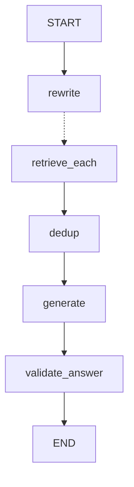

# 24 · LangGraph 编排与 Agent 设计面试题（进阶）

> 面试题系列第 2 篇。上一篇（[23 篇](23-检索与向量库面试题.md)）讲的是
> 「检索到的东西对不对」，本篇讲的是**「这些步骤该怎么串、失败了谁兜、
> 跑完了怎么证明它跑过」**。
>
> 这一篇最值钱的材料是：**本项目里删掉过一整套
> Plan-Execute-Replan Agent（962 行）**，换成了固定流程。
> 面试里「你为什么删掉了一个 Agent」比「你实现了一个 Agent」
> 更能说明你理解 Agent 的边界在哪。
>
> 每题结构同上一篇：**考点 / 标准回答 / 真实代码 / 追问链 / 拓展**。

| 部分 | 题号 | 主题 |
|---|---|---|
| 一 | 1–5 | 为什么选 LangGraph，以及它到底解决了什么 |
| 二 | 6–11 | State 设计与 Reducer（并行写冲突） |
| 三 | 12–17 | Send 扇出、条件边、超步模型 |
| 四 | 18–22 | **删掉 Plan-Execute Agent 的完整决策**（本篇核心） |
| 五 | 23–26 | 节点级可观测性：span 与 ContextVar 拷贝语义 |
| 六 | 27–29 | 流式输出、超时预算与部分结果交付 |
| 七 | 30–33 | 三种 Agent 架构并存、ReAct、MCP 与工具设计 |
| 八 | 34–35 | 演进方向与一句话总结 |

---

# 一、为什么选 LangGraph

## 1. 为什么用 LangGraph 而不是自己写编排？

### 考点

会不会为了用框架而用框架。**能说出「不用它我要自己实现什么」
才算真的理解它的价值。**

### 标准回答

我们的 RAG 链路有五个节点，其中一个要**扇出成 N 个并行实例**
再汇总。如果自己写，我至少要实现四件事：

1. **并行 fan-out / fan-in 的调度**：`asyncio.gather` 能做扇出，
   但 N 是运行时才知道的（子查询数量由 LLM 决定），
   且要处理「部分分支失败其余继续」。
2. **并行写同一个状态字段的合并规则**：4 条检索分支都要往
   `documents` 里写，裸 dict 会互相覆盖。
3. **每步的完整状态快照**：超时中断时要能回答「已经拿到了什么」。
4. **统一的节点钩子**：给所有节点挂计时埋点。

LangGraph 把前三件事做成了内置能力（Send / Reducer / astream），
第四件事它没提供，我们自己包了一层（`instrument_node`）。

**换句话说：我用它不是因为它是「Agent 框架」，
而是因为它是一个带状态合并语义的并行调度器。**
我们这个项目里其实没用到它的「Agent」部分 —— 见第四部分。

### 真实代码

整张图只有 30 行（`app/agent/rag_v2/graph.py:22-50`）：

```python
def build_rag_v2_graph():
    graph = StateGraph(RAGState)

    graph.add_node("rewrite", instrument_node("rewrite", rewrite_node))
    graph.add_node("retrieve_each", instrument_node("retrieve_each", retrieve_each_node))
    graph.add_node("dedup", instrument_node("dedup", dedup_node))
    graph.add_node("generate", instrument_node("generate", generate_node))
    graph.add_node("validate_answer", instrument_node("validate_answer", validate_answer_node))

    graph.add_edge(START, "rewrite")
    graph.add_conditional_edges("rewrite", _fanout_to_retrieve, ["retrieve_each"])
    graph.add_edge("retrieve_each", "dedup")
    graph.add_edge("dedup", "generate")
    graph.add_edge("generate", "validate_answer")
    graph.add_edge("validate_answer", END)

    return graph.compile()
```

**这张图的形状值得注意：它是一条直线，只有一个分叉点。**
没有循环，没有条件跳转，没有 Agent 自主决策。
下面很多题的答案都从这个形状里长出来。

### 追问链

**Q：LangChain 的 LCEL（`|` 管道）不够吗？**

不够，卡在**动态扇出**上。

LCEL 的 `RunnableParallel` 是**编译期固定**的并行结构 ——
你得在写代码时就知道有几路。而我们的子查询数量是
LLM 在运行时生成的（1~4 条，取决于问题复杂度和改写是否降级）。

第二个卡点是**部分失败**。LCEL 里一路抛异常整条链就断了，
要做「这一路失败其余照常」得自己在每个分支里包 try。
LangGraph 里这是节点自己的职责，且失败信息能通过 reducer
汇总到 state 里（`retrieve_failures`）。

第三个卡点是**中间状态可见性**。LCEL 是数据流，中间结果
在管道里流过就没了；LangGraph 是状态机，每一步的完整状态
都能被 `astream` 观察到 —— 这是我们超时降级的前提（第 34 题）。

**Q：那为什么不用 CrewAI / AutoGen 这类多 Agent 框架？**

因为我们**不需要多个 Agent 互相对话**。

那类框架的核心抽象是「角色 + 对话」，适合「产品经理 Agent
和工程师 Agent 讨论方案」这种开放式协作。它们的代价是
**控制流不可预测** —— 谁什么时候说话、说几轮，由模型决定。

我们的场景是运维首响，要求是**可审计、可复现、耗时可预测**。
一条告警进来，必须走「检索 SOP → 生成报告 → 质检」这三步，
不能今天走三步明天走七步。**在这种场景下，
控制流的不确定性是缺陷而不是特性。**

LangGraph 的定位刚好：它允许我写死控制流（我们就是这么做的），
也允许我加循环让模型自主决策（我们试过，然后删了）。
**框架给了选择权，但选择是我做的。**

---

## 2. LangGraph 的节点、边、状态分别对应什么？

### 标准回答

- **State**：一个 `TypedDict`，全图共享。节点的输入是完整 state，
  输出是一个**局部更新（patch）**，不是新的完整 state。
- **Node**：一个 `state -> patch` 的函数。可以是同步或异步。
- **Edge**：决定下一步执行谁。分三种：
  - `add_edge(a, b)`：固定边，a 完了走 b。
  - `add_conditional_edges(a, fn, [...])`：a 完了调 `fn`
    决定走哪个（或哪些）。
  - `Send("node", payload)`：从 `fn` 返回，**给目标节点
    单独投递一份输入**，可以返回多个 → 这就是扇出。

**关键心智模型：节点返回 patch 而不是 state。**

```python
async def rewrite_node(state: RAGState) -> Dict[str, Any]:
    ...
    return {"sub_queries": sub_queries}   # 只返回改动的键
```

这个设计的直接好处是**并行安全**：4 个检索分支各返回
`{"documents": [...]}`，框架按 reducer 规则合并，
而不是让最后一个分支的完整 state 覆盖前面的。

### 追问链

**Q：那节点里能不能直接改 state？**

语法上能（Python 的 dict 是可变的），**但绝不要这么做**。

因为并行分支拿到的 state 可能是同一个对象的引用。
一个分支 `state["documents"].append(...)`，
另一个分支也 append —— 你绕过了 reducer，
得到的结果取决于两个分支的执行时序，是**不可复现的 bug**。

我们项目里所有节点都是「读 state，返回新 dict」，
没有任何一处原地改 state。这条纪律和 23 篇里
「从仓储层读出来的 ORM 对象一律视为只读」是同一类约束。

**Q：`add_conditional_edges` 的第三个参数（那个列表）是干什么的？**

```python
    graph.add_conditional_edges("rewrite", _fanout_to_retrieve, ["retrieve_each"])
```

它是**可达节点的声明**，给框架做静态校验和画图用。

`_fanout_to_retrieve` 返回的是运行时才确定的 `Send` 列表，
框架无法静态分析出「这个函数会跳到哪些节点」。
显式声明之后，`graph.get_graph().draw_mermaid()` 能画出正确的边，
而且如果函数返回了一个不在列表里的节点名，能更早报错。

不传这个参数图也能跑，但**可视化出来是断的** ——
对一个需要向别人解释链路的项目来说，这个成本不该省。

---

## 3. `graph.compile()` 做了什么？

### 标准回答

把声明式的图（节点集合 + 边集合）编译成一个可执行的
`CompiledStateGraph`，具体做三件事：

1. **校验图结构**：有没有孤立节点、有没有从 START 不可达的节点、
   条件边声明的目标是否都存在。
2. **构建执行计划**：算出每个超步（superstep）该并行执行哪些节点。
3. **绑定运行时设施**：checkpointer、interrupt 点、
   以及 `invoke/ainvoke/stream/astream` 这套统一入口。

我们的编译是**模块级别执行一次**的（`graph.py:53`）：

```python
rag_v2_graph = build_rag_v2_graph()
```

因为编译结果是**无状态可复用**的 —— 状态在每次调用时
由 `astream(inputs)` 传入，图本身不持有任何请求数据。
每个请求重新编译一次是纯粹的浪费。

### 追问链

**Q：模块级构造有什么风险？**

有一个真实踩过的坑：**模块级构造会在 import 时触发副作用。**

这个项目里 `app/services/vector_store_manager.py:177` 就是
模块级构造 vector store，导致 `python -c "import app.agent.rag_v2"`
会**真的去连 Milvus**。写脚本探查代码结构时会直接卡住或报错。

`rag_v2_graph` 本身还好（编译不产生 IO），但它 import 了
`nodes.py`，而 `nodes.py` 的调用链最终会碰到那个 vector store。
所以实际效果是**「import 这张图 = 连一次 Milvus」**。

正确做法是延迟初始化（第一次用到时才建连接），
或者提供一个 `get_vector_store()` 函数而不是模块级变量。
**没改的原因是它一直「能用」——直到你想在测试外面单独探查代码。
这类问题的特征是：不影响生产，只影响开发体验，所以永远排不上优先级。**

**Q：为什么不传 checkpointer？**

v2 这张图**故意不带 checkpointer**，而 v1（`rag_agent_service.py:136`）
带了 `MemorySaver`。这是两条路径的一个关键差异：

| | v1（ReAct） | v2（固定流程） |
|---|---|---|
| checkpointer | `MemorySaver()` | 无 |
| 会话历史存哪 | checkpointer 的 thread | PostgreSQL + 滚动摘要 |
| 进程重启后 | **历史全丢** | 历史还在 |

v2 不用 checkpointer 是因为**会话记忆已经有更好的归宿**：
`conversation_memory_service` 把消息落 PostgreSQL，
再压缩成有预算上限的上下文注入（见 23 篇 Q35）。

`MemorySaver` 是纯内存的，多 worker 部署下每个 worker
一份独立历史 —— 用户第二句话打到另一个 worker 就失忆了。
**这不是 checkpointer 的错，是「用内存实现会话持久化」的错。**
如果要用 checkpointer 做持久化，应该上 `PostgresSaver`。

---

## 4. 什么是超步（superstep）？为什么这个概念重要？

### 标准回答

LangGraph 借的是 **Pregel** 的执行模型（Google 那篇图计算论文）。
一次执行被切成若干**超步**，每个超步内：

1. 所有被激活的节点**并行**执行；
2. 全部执行完之后，把它们的 patch **一次性**合并进 state；
3. 根据边的规则算出下一个超步激活哪些节点。

关键性质是 **超步之间有屏障（barrier）**：
下一个超步的节点，看到的一定是上一个超步全部合并完的 state。

我们这张图的超步序列：

```
超步 1: rewrite
超步 2: retrieve_each × N   ← 并行，N 由运行时决定
超步 3: dedup                ← 一定看得到全部 N 条分支的结果
超步 4: generate
超步 5: validate_answer
```

### 为什么这个概念重要

因为它直接决定了**「什么判断能在哪里做」**。

`dedup_node` 里有这么一段判定（`nodes.py:238-256` 附近），
它要区分三种情况：

- 部分分支失败 → `PARTIAL_RETRIEVAL`
- 全部分支失败 → `RETRIEVAL_FAILED`
- 全部成功但没召回 → `RETRIEVAL_EMPTY`

**这个三分判断只有在 fan-in 之后才做得出来。**
单条 `retrieve_each` 分支永远无法区分
「只有我失败了」和「所有人都失败了」——
它看不到别的分支。

代码注释直接写了这件事：

```python
    # dedup 是 fan-in 之后的第一个节点，也是唯一能看到全部分支结果的地方。
```

**理解超步屏障 = 知道「汇总判断必须放在 fan-in 节点」。**
这是 LangGraph 里最容易被忽略、但一旦搞错就必然出 bug 的地方。

### 追问链

**Q：如果一个分支特别慢，超步 3 会一直等吗？**

会。**屏障是同步的，超步 2 的最慢分支决定了超步 2 的耗时。**

这就是为什么我们在外层套了总预算（`asyncio.timeout`，第 34 题）
而不是只给单个 LLM 调用设 timeout —— 屏障意味着
**慢分支的耗时不会被并行掉，它会直接加到总时长上**。

也是为什么每条分支的 span 要单独记（第 28 题）：
只有看到 4 条分支各自的耗时，才能发现「有一条总是慢 3 秒」。
在此之前日志里 4 条分支交织在一起，根本对不出来。

**Q：并行分支里如果有一个抛异常了，会怎样？**

默认行为是**整个超步失败，异常向上冒**，其余分支的结果丢弃。

我们不接受这个行为，所以 `retrieve_each_node` 是
**刻意不抛异常**的 —— 它把失败包成一条记录返回：

```python
        return {"retrieve_failures": [{"query": query, "code": code, "message": str(exc)}]}
```

它的 docstring 明确写了这条契约（「这个节点永远不抛」）。
代价是：**从图的视角看，检索失败是一次「成功」的执行**，
所以 `instrumentation.py` 里必须靠看 patch 内容来判定降级，
不能只看有没有抛异常（第 30 题）。

---

## 5. LangGraph 和「Agent」是什么关系？

### 考点

这题是在探你有没有把「用了 LangGraph」等同于「做了 Agent」。
**这两件事完全独立。**

### 标准回答

LangGraph 是**编排框架**，Agent 是**一种控制流模式**。
用 LangGraph 可以搭 Agent，也可以搭一条写死的流水线 ——
我们两种都有。

区分的标准只有一个：**控制流由谁决定。**

| | 控制流决定者 | 本项目实例 |
|---|---|---|
| **固定流程（Workflow）** | 代码 | `rag_v2` 图、`alert_diagnosis_orchestrator` |
| **Agent** | 模型 | v1 的 ReAct 路径（`rag_agent_service`） |

`rag_v2` 这张图**不是 Agent**，尽管它用 LangGraph 写、
里面调了三次 LLM、还有并行扇出。因为它的路径是
`rewrite → retrieve → dedup → generate → validate`，
**每次都一样，模型无权改变它。**

模型在这张图里的角色是「在指定的槽位上完成指定的文本任务」，
不是「决定下一步做什么」。

### 追问链

**Q：那 `add_conditional_edges` 算不算模型决策？**

不算 —— 取决于**条件函数读的是什么**。

我们唯一的条件边是：

```python
def _fanout_to_retrieve(state: RAGState) -> list[Send]:
    sub_queries = state.get("sub_queries", []) or []
    return [Send("retrieve_each", {"query": q}) for q in sub_queries]
```

它读 `sub_queries` 的**长度**来决定扇出几路。
这里确实有模型的影响（子查询是 LLM 生成的），
但模型影响的是**并行度**，不是**路径**。
不管子查询是 1 条还是 4 条，下一步永远是 `dedup`。

**真正的 Agent 条件边长这样**（我们删掉的那套）：

```python
        def should_continue(state: PlanExecuteState) -> str:
            if state.get("response"):
                return END
            return NODE_EXECUTOR      # 回去再执行一轮
```

它读的是模型的**判断结果**（`response` 字段是 replanner 填的），
模型说「够了」就结束，说「不够」就再循环一轮。
**这才是模型决定控制流。**

**Q：一句话总结这个区别？**

**固定流程是「我知道该怎么做，让模型帮我做每一步」；
Agent 是「我不知道该怎么做，让模型自己想」。**

选哪个取决于**问题空间是否可枚举**。
RAG 问答的步骤是可枚举的（检索、生成、校验），
所以写死更好。而「排查一个没见过的线上故障」
步骤不可枚举，那才需要 Agent。

这个判断标准直接导向第四部分：**我们删掉 Plan-Execute
的根本原因，就是发现我们的问题空间其实是可枚举的。**

---

# 二、State 设计与 Reducer

## 6. 你们的图状态是怎么设计的？

### 真实代码

`app/agent/rag_v2/state.py:10-34`：

```python
class RAGState(TypedDict, total=False):
    """RAG v2 流程的共享状态"""

    question: str
    conversation_context: str
    sub_queries: List[str]
    documents: Annotated[List[Document], operator.add]
    retrieve_failures: Annotated[List[Dict[str, Any]], operator.add]
    deduped_documents: List[Document]
    answer: str
    validation: Dict[str, Any]
    degrade_reasons: Annotated[List[str], operator.add]
```

九个字段，**三个带 reducer，六个不带**。这个区分是核心。

### 标准回答

设计原则是：**字段是否会被多个并行分支同时写。**

| 字段 | 写入者 | 是否需要 reducer |
|---|---|---|
| `question` / `conversation_context` | 图外部（API 层）传入 | 否 |
| `sub_queries` | `rewrite`，单节点 | 否 |
| `documents` | `retrieve_each` × N，**并行** | **是** |
| `retrieve_failures` | `retrieve_each` × N，**并行** | **是** |
| `deduped_documents` | `dedup`，单节点 | 否 |
| `answer` | `generate`，单节点 | 否 |
| `validation` | `validate_answer`，单节点 | 否 |
| `degrade_reasons` | **任意节点，可能多个** | **是** |

前两个 reducer 的必要性很直观（4 条检索分支）。
第三个 `degrade_reasons` 值得单独说 —— 它不在同一个超步里并发，
但**跨超步也会被多次写**：`rewrite` 可能写 `REWRITE_FAILED`，
`retrieve_each` 可能写 `RETRIEVAL_FAILED`，
`validate_answer` 可能写 `VALIDATION_FAILED`。

注释解释了为什么用列表而不是单值：

```python
    # 用列表而非单值：一次运行可能同时命中多个原因
    # （例如部分检索失败 + 证据不足），压成一个会丢信息。
```

**这是一个容易做错的设计。** 直觉上「本次降级原因」像是一个单值，
但实际运行里降级是会叠加的 —— 检索少召回了 2 篇（部分降级），
导致证据不足（第二个降级）。如果用单值，后写的覆盖先写的，
排障时只看到「证据不足」，会误判成「知识库缺文档」，
而真正的根因是「有 2 条检索分支挂了」。

**丢掉的不是一个字符串，是因果链的上游。**

### 追问链

**Q：`total=False` 是什么意思？为什么用它？**

`TypedDict` 默认要求**所有键都必须存在**。`total=False`
把所有键变成可选的 —— 也就是 **patch 语义**：
节点只返回它改动的键，其余键不存在也合法。

这正好匹配 LangGraph 的节点契约（`state -> patch`）。
如果不加 `total=False`，`rewrite_node` 返回
`{"sub_queries": [...]}` 会被类型检查器判为缺少八个必填键。

**Q：`total=False` 的代价是什么？**

**拼错的键会被静默接受。**

`RAGState` 是 `TypedDict`，运行时**根本不做校验**（它就是个 dict），
而 `total=False` 让静态检查也放松了。所以：

```python
    return {"sub_querys": sub_queries}    # 拼错了，但不会报错
```

结果是这个键跟着 state 一路传下去，
`dedup_node` 读 `state.get("sub_queries")` 拿到空 —— **静默失效**。

这个隐患在项目里有一个具体的体现：`instrumentation.py` 里
必须显式 `_strip_hint` 把 `_span` 键摘掉：

```python
def _strip_hint(patch: Any) -> Any:
    """把 `_span` 提示键从 patch 里摘掉，不让它进入图状态。

    RAGState 是 TypedDict(total=False)，多塞一个未声明的键不会报错，
    但会跟着 state 一路传下去，最终出现在 astream 的快照里 ——
    埋点的内部约定不该泄漏成对外可见的状态字段。
    """
```

**注意这段注释的逻辑：正因为框架不会拦住多余的键，
所以我们必须自己拦。** 这是「知道工具的宽松之处在哪，
并在那个位置自己加纪律」。

缓解手段（没做）：用 Pydantic model 做 state。
LangGraph 支持 `StateGraph(SomePydanticModel)`，
能得到运行时校验。代价是每次合并都要走一遍 Pydantic 校验，
以及 reducer 的写法更啰嗦。**在五个节点的图里，
这个交换不划算；如果图长到二十个节点，我会换。**

---

## 7. `Annotated[List[Document], operator.add]` 到底做了什么？

### 标准回答

`Annotated` 的第二个参数被 LangGraph 读作**这个字段的 reducer**：
当有新值写入时，不是覆盖，而是 `reducer(旧值, 新值)`。

`operator.add` 对 list 就是 `+`，即拼接。所以：

```
分支1 返回 {"documents": [A, B]}
分支2 返回 {"documents": [C]}
分支3 返回 {"documents": [D, E]}
                ↓ 合并
state["documents"] == [A, B, C, D, E]
```

**没有 reducer 会怎样：** 后写的覆盖先写的，
最终 `documents` 只剩某一个分支的结果。
4 条分支各召回 4 篇，本该有 16 篇，实际只剩 4 篇 ——
而且**不报错**，看起来一切正常，只是召回量莫名偏低。

这是我认为 LangGraph 里**最危险的一个默认行为**：
漏写 reducer 的后果是静默的数据丢失，不是异常。

### 追问链

**Q：`operator.add` 拼接出来的顺序是确定的吗？**

**不是完全确定的，而这正是一个真实的问题。**

超步内的分支是并行执行的，`operator.add` 按**完成顺序**拼接。
所以 `documents` 的顺序是「哪条分支先跑完」，
不是「哪条子查询更重要」，也不是「相关性从高到低」。

这个不确定性在 `dedup_node` 里变成了一个真实缺陷：

```python
    unique_docs = ...            # 按 documents 顺序去重
    return {"deduped_documents": unique_docs[:FINAL_TOP_K]}
```

`[:FINAL_TOP_K]` 是**按 fan-in 到达顺序截断，不是按相关性截断**。
一条慢分支召回的最佳文档，可能因为它到得晚而被切掉。

修法有两个：

1. **交错合并**：不用 `operator.add`，写一个自定义 reducer，
   按「各分支内部的 RRF 排名」交错取（分支1第1名、分支2第1名、
   分支1第2名……）。这样截断切掉的是各分支的尾部而不是某一整条分支。
2. **在这里插 rerank**（23 篇 Q16 的结论）：用 cross-encoder
   给全部候选重新打分再截断，顺序问题自然消失。

我倾向先做 1，因为它零模型成本、可单测、且不依赖 rerank 有效
（而 rerank 我们已经实测当前无效）。

**Q：自定义 reducer 怎么写？**

就是一个 `(旧值, 新值) -> 合并值` 的函数：

```python
def _merge_by_rank(left: list[Document], right: list[Document]) -> list[Document]:
    """按各分支内部排名交错合并，避免慢分支的好文档被尾部截断。"""
    merged: list[Document] = []
    for pair in zip_longest(left, right):
        merged.extend(doc for doc in pair if doc is not None)
    return merged

documents: Annotated[List[Document], _merge_by_rank]
```

有个陷阱：**reducer 会被调用多次，而且是两两归约的**。
4 条分支不是一次性传进来，是 `f(f(f(b1, b2), b3), b4)`。
所以 reducer 必须满足**结合律**，否则结果依赖归约顺序。

上面这个 `zip_longest` 实现**其实不满足结合律** ——
`f(f(b1,b2),b3)` 和 `f(b1,f(b2,b3))` 结果不同。
正确做法是让分支返回带排名标记的元素
（`{"rank": i, "doc": d}`），reducer 只做拼接，
真正的交错排序在 `dedup` 节点里一次性做完。

**这是个好例子：reducer 应该保持简单（拼接），
复杂的合并逻辑放到 fan-in 节点里做。**
因为 fan-in 节点看到的是全量数据，不受两两归约的约束。

---

## 8. 节点为什么要「刻意不抛异常」？这不是把错误藏起来了吗？

### 考点

这题在考「吞异常」和「降级」的区别。**答不好会被认为是在掩盖错误。**

### 标准回答

区别在于：**吞掉是让错误消失，降级是让错误改变形态但不消失。**

我们的 `retrieve_each_node` 不抛异常，但错误没有消失，
它变成了 state 里的一条结构化记录：

```python
        return {
            "documents": [],
            "retrieve_failures": [{"query": query, "error": str(exc), "code": code}],
        }
```

这条记录有四个下游消费者，每一个都会因为它改变行为：

1. **`dedup_node`** 据此判定三种降级原因（`nodes.py:238-256`）；
2. **`generate_node`** 据此往 prompt 里注入 `partial_note`，
   告诉模型「证据不完整」；
3. **`instrumentation.py`** 据此把 span 标成 DEGRADED
   并 `count_degrade()`；
4. **`count_retrieval_failure(code)`** 在异常分支就地打了指标。

**如果这叫「藏起来」，那被藏起来的东西不该出现在
四个地方并且改变模型的输出措辞。**

### 为什么必须这样

`nodes.py:161-169` 的 docstring 写了完整理由：

```
    为什么必须在这里兜住异常：
    graph.py 用 `Send` 把 N 个子查询并行 fan-out 到本节点的 N 个实例。
    LangGraph 的语义是「任一并行分支抛异常 → 整个 super-step 失败 → 整张图崩」。
    也就是说改造前只要 Milvus 抖一下，哪怕另外 3 个分支已经召回了充足证据，
    用户拿到的仍然是一个 500 —— 已经做完的工作被整批丢掉。
```

**核心是并行语义带来的放大效应**：4 条分支中任意 1 条失败，
就等于 4 条全废。失败概率从 p 变成 `1-(1-p)^4` ——
单条 5% 的失败率会变成整体 18.5%。

**扇出提高了召回率（23 篇 Q23），但同时也放大了失败率。**
这是同一个数学式子的两面。不兜异常的话，
多查询改写这个「提高召回」的优化会净损害可用性。

### 追问链

**Q：那什么情况下节点应该抛？**

标准是：**这个失败之后，后续节点还能不能做有意义的工作。**

- `retrieve_each` 失败 → 其他分支还有证据 → **不抛**。
- `rewrite` 失败 → 退回原始问题照样能检索 → **不抛**
  （`nodes.py:117-122` 的注释称它是「全链路里最该降级的一步」）。
- `generate` 失败 → 没有答案，但可以返回一个诚实的说明 → **不抛**。
- `validate_answer` 失败 → 第一道防线（证据约束 prompt）还在 → **不抛**，
  fail-open。
- **数据库连不上** → 后面每一步都要落库 → **抛**。

反过来说，五个节点都不抛，是因为**它们都不是「必须成功」的步骤**。
这不是巧合，是这条链路的设计特征：
每一步都有一个「更差但可用」的退路。

**Q：怎么保证「不抛」这个契约不被后来的人破坏？**

三个手段，我们做了两个：

1. **写在 docstring 里**（做了）—— 契约要在代码里说清楚。
2. **单测覆盖**（做了）—— `tests/unit/test_degradation_paths.py`
   专门测「依赖挂了，节点仍返回合法 patch」。
3. **类型层面约束**（没做）—— 理论上可以让节点返回
   `Result[Patch, Error]` 这类显式类型，让「可能失败」
   变成签名的一部分。Python 里这么写会很别扭，
   而且 LangGraph 要求节点返回 dict，得再包一层适配。**不值得。**

第 2 条是真正的防线。docstring 会被忽略，测试不会 ——
**如果有人把 try 删了，测试会红。**

---

## 9. `retrieve_failures` 里为什么要存 `code`？存 `error` 文本不够吗？

### 标准回答

因为 **文本不可聚合，错误码可以。**

```python
            {"query": query, "error": str(exc), "code": code}
```

两个字段各有分工：

- `error`（原始异常文本）：给人看，排单个 case 用。
  内容可能是 `<MilvusException: (code=2, message=Fail connecting to
  server on 10.0.0.5:19530, illegal connection params or server unavailable)>`。
- `code`（`error_code_of(exc)` 归一化出的码）：给机器看，
  可以做 label、可以 group by、可以画趋势。

具体体现在两个地方。第一，**指标的 label**：

```python
        count_retrieval_failure(code)
```

如果用原始文本做 label，每个不同的 IP、端口、时间戳
都会产生一个新的时间序列 —— 这就是 23 篇和 metrics 模块里
反复强调的**标签基数爆炸**，会把 Prometheus 打挂。

第二，**span payload 里只留码不留报文**
（`instrumentation.py:66-69`）：

```python
        # 只留错误码不留完整报文：错误码可聚合，报文在日志里已经有了。
        payload["retrieve_failure_codes"] = sorted(
            {str(item.get("code")) for item in failures if isinstance(item, dict)}
        )
```

注意这里用了 `sorted(set(...))` —— **去重 + 排序**。
去重是因为 4 条分支挂了通常是同一个原因，
存 4 遍 `MILVUS_UNAVAILABLE` 没有增量信息；
排序是为了让 payload **可比对** ——
两次运行如果错误码集合相同，序列化出来的 JSON 应该一样，
这样 diff 两条 span 才有意义。

### 追问链

**Q：`error_code_of` 是怎么分类的？**

它按**异常类型**分类，而不是按错误文本匹配关键词。
这就是为什么 23 篇里强调 `raise ... from e` 很重要 ——
`from e` 保留了 `__cause__` 链，`error_code_of`
才能顺着链找到原始异常类型。

如果底层 `raise RuntimeError("检索失败")` 而不带 `from e`，
原始的 `MilvusException` 类型信息就断了，
所有检索失败都会归到一个笼统的码上，
**「Milvus 连不上」和「集合没加载」就再也分不开了。**

**Q：为什么不直接用异常类名当 code？**

因为异常类名是**实现细节**，会随依赖升级变化。
pymilvus 从 2.3 到 2.4 改过异常层次结构，
如果指标 label 直接用类名，升级依赖会导致
**历史指标断裂**（旧序列停止，新序列出现，趋势图断成两截）。

`error_code_of` 是一层**稳定的抽象**：
底层类名怎么变，映射到的码不变。
代价是要维护一张映射表，且遇到没见过的异常要有兜底码。

---

## 10. 为什么降级判定放在 `dedup` 而不是 `retrieve_each`？

### 标准回答

因为**单个并行分支看不到全局**。这是超步屏障的直接推论。

`nodes.py:234-237` 的注释：

```python
    # 在这里判定检索侧的降级原因，而不是在 retrieve_each 里。
    # 原因是单个分支看不到全局：它只知道「我失败了」，判断不了
    # 「是全都失败了，还是只有我失败」—— 而这两者的处置方向完全不同。
    # dedup 是 fan-in 之后的第一个节点，是唯一能看到全部分支结果的位置。
```

三分判定的完整逻辑（`nodes.py:238-256`）：

```python
    failures = state.get("retrieve_failures", []) or []
    degrade_reasons: List[str] = []
    if failures:
        if unique_docs:
            degrade_reasons.append(DegradeReason.PARTIAL_RETRIEVAL.value)
        else:
            degrade_reasons.append(DegradeReason.RETRIEVAL_FAILED.value)
    elif not unique_docs:
        degrade_reasons.append(DegradeReason.RETRIEVAL_EMPTY.value)
```

三种结果对应**三个完全不同的处置动作**：

| 判定 | 含义 | 值班该做什么 |
|---|---|---|
| `PARTIAL_RETRIEVAL` | 有失败，但仍有证据 | 看失败码，可能不用管 |
| `RETRIEVAL_FAILED` | 全失败，零证据 | **去修 Milvus** |
| `RETRIEVAL_EMPTY` | 没失败，但零命中 | **去补文档** |

后两个的区分是这段代码存在的全部理由。注释说得很直接：

```python
            # 全部失败，一条证据都没有：这是基础设施问题，不是知识库缺文档。
            # 必须与 RETRIEVAL_EMPTY 区分开 —— 前者要修 Milvus，后者要补文档。
```

**如果这两个合成一个「检索无结果」，值班的人会去翻知识库
找为什么没有 CPU 相关文档 —— 而实际上 Milvus 已经挂了半小时。
这就是用一个假原因掩盖真原因。**

### 追问链

**Q：`dedup` 是个同步函数，而其他四个节点是 async。混用没问题吗？**

LangGraph 支持混用，但**包装层必须分别处理**。
`instrumentation.py:128-146` 就是为这件事写的：

```python
    if inspect.iscoroutinefunction(func):

        async def async_wrapper(*args, **kwargs):
            with span_scope(node) as span:
                patch = await func(*args, **kwargs)
                ...

    def sync_wrapper(*args, **kwargs):
        with span_scope(node) as span:
            patch = func(*args, **kwargs)
            ...
```

docstring 说明了为什么不能只写 async 版本：

```
    不能只写 async 版本 —— 那会把同步节点的返回值变成协程，
    LangGraph 拿到一个没 await 的协程，图会直接崩。
```

这是个很实际的坑：如果 `sync_wrapper` 被写成 `async def`，
`dedup_node` 的返回值会变成一个未 await 的 coroutine 对象。
LangGraph 拿它去做 reducer 合并，会报
`TypeError: unsupported operand type(s) for +: 'list' and 'coroutine'` ——
**报错点离病根很远**，非常难查。

**Q：`dedup` 为什么是同步的？**

因为它**没有 IO**。纯 CPU 操作（哈希、集合去重、切片），
写成 async 只会增加一次不必要的事件循环调度。

判断标准很简单：**节点里有 await 才写 async。**
`rewrite`/`generate`/`validate` 有 LLM 调用，
`retrieve_each` 有 `to_thread`，只有 `dedup` 什么都没有。

---

## 11. 图状态里能不能放数据库 Session？

### 标准回答

**不能，而且这是一个我们踩过并绕开的坑。**

`span_context.py:9-11` 记录了理由：

```
2. **节点拿不到 Session。** LangGraph 的节点签名是 `state -> patch`，
   要塞一个 db session 进去，就得让它穿过 state 或改所有节点的签名 ——
   而 state 是要被序列化的，往里塞 Session 是自找麻烦。
```

三个具体问题：

1. **state 要可序列化。** 用了 checkpointer 的话，
   state 会被 pickle/JSON 存起来。SQLAlchemy 的 `Session`
   持有数据库连接，序列化它没有意义（反序列化出来的连接是死的）。
2. **生命周期不匹配。** Session 由 FastAPI 的
   `Depends(get_db)` 管理，请求结束就关。
   如果 state 里存了它，而图因为某种原因活得更久
   （比如被 checkpointer 存了下来），拿到的是一个已关闭的 Session。
3. **并行分支下的线程安全。** SQLAlchemy 的 Session
   **不是线程安全**的。4 条并行分支共享一个 Session，
   其中一条走 `asyncio.to_thread` 到另一个线程去用它 ——
   这是典型的未定义行为。

### 我们的解法

**让图完全不碰数据库。** 所有 IO 都在图的外面：

```
API 层（chat_v2.py，持有 db session）
  ├─ 读会话记忆    → conversation_memory_service（用 db）
  ├─ 跑图          → rag_v2_service.query(...)     ← 图内零数据库
  ├─ 写对话        → ConversationRepository（用 db）
  ├─ 写 trace      → ChatRunTraceRepository（用 db）
  └─ 写 span       → flush_spans(db, trace_id=...)
```

图的输入是两个字符串（`question` + `conversation_context`），
输出是一个 dict。**它是一个纯函数式的黑盒**（除了调 LLM 和 Milvus）。

这带来一个额外好处：**图变得极易测试。**
`tests/unit/test_rag_v2_nodes.py` 里测节点不需要数据库，
mock 掉 LLM 和检索服务就够了。

### 追问链

**Q：那节点里想记点东西到数据库怎么办？**

这正是 `span_context.py` 解决的问题，它用的是
**ContextVar 收集 + 图外一次性落盘**：

```
节点执行时  → record_span() 往内存 list append（零 IO）
图跑完之后  → flush_spans(db, trace_id) 一次 bulk insert
```

`span_context.py:12-13` 还给了第三个理由：

```
3. **写库次数爆炸。** 一次请求 8 个节点（含 4 条并行检索），
   每个节点各 commit 一次就是 8 次往返。这正是 AIOps 时间线犯过的错。
```

注意最后半句 —— **「这正是 AIOps 时间线犯过的错」**。
项目里另一条链路（诊断任务的时间线）就是每个阶段各写一次库，
所以这不是理论推演，是同一个项目里踩过之后换的写法。

**Q：`trace_id` 为什么必须等图跑完才有？**

因为 `ChatRunTrace` 这行记录是**图跑完之后**才创建的
（`chat_v2.py:97-106`），它要存 answer、validation 这些
只有跑完才知道的字段。

**span 的外键指向 trace，所以 span 只能在 trace 之后写。**
`chat_v2.py:107-109` 的注释：

```python
        # trace 落库之后才有 trace_id，span 才有地方挂 —— 这是「跑完一次性
        # flush」而不是「节点各自写库」的根本原因。
        flush_spans(db, trace_id=trace.id)
```

**换个设计能不能避免？** 能：先创建一条 PENDING 状态的 trace
拿到 id，再跑图，跑完 update。代价是多一次写库和一个中间状态，
而且失败时可能留下 PENDING 悬空记录（要有清理任务）。
**在「一次多余的写库」和「一个需要清理的中间状态」之间，
我选前者更简单。**

---

# 三、Send 扇出、条件边与并行

## 12. `Send` 是什么？和普通的边有什么不同？

### 真实代码

`graph.py:17-19`，整个扇出逻辑只有三行：

```python
def _fanout_to_retrieve(state: RAGState) -> list[Send]:
    sub_queries = state.get("sub_queries", []) or []
    return [Send("retrieve_each", {"query": q}) for q in sub_queries]
```

### 标准回答

普通边传递的是**完整 state**：`add_edge("a", "b")` 意味着
b 拿到的是合并后的整个 state。

`Send("node", payload)` 传递的是**你指定的 payload**，
而且可以返回多个 —— 每个 `Send` 都会创建目标节点的一个**独立实例**。

所以 `retrieve_each_node` 的签名不是 `(state: RAGState)`，
而是 `(task: RetrieveTask)`：

```python
class RetrieveTask(TypedDict):
    """fan-out 时传入单个 retrieve_each 节点的载荷"""

    query: str
```

**这个节点看不到 state 的其他字段** —— 它只知道自己要检索哪个 query。
这是一种天然的隔离：它不可能误读别的分支的数据，
也不可能因为 state 里某个字段变了而行为改变。

三个关键差异：

| | 普通边 | Send |
|---|---|---|
| 目标实例数 | 1 | N（运行时决定） |
| 节点看到的输入 | 完整 state | 自定义 payload |
| 结果如何汇总 | 直接写 state | 走 reducer 合并 |

### 追问链

**Q：`Send` 出去的节点还能读 state 吗？**

**读不到**，它只有 payload。这个限制有时会碍事 ——
比如 `retrieve_each` 如果想根据 `conversation_context`
调整检索策略，就拿不到。

绕法有两个：

1. **把需要的字段一起塞进 payload**：
   `Send("retrieve_each", {"query": q, "ctx": state["conversation_context"]})`。
   简单直接，代价是 payload 变大（并行 N 份，各存一份副本）。
2. **改用普通边 + 节点内部并行**：即节点里自己
   `asyncio.gather`。这样能读全量 state，
   但**失去了每条分支独立的 span** —— 而节点级可观测性
   正是我们要的（第 28 题）。

我们选了 1 的精简版（只传 query），因为当前不需要别的字段。
**如果哪天需要，我会传字段而不是改架构** ——
因为独立 span 的价值高于 payload 的一点冗余。

**Q：`Send` 的目标节点可以是不同的吗？**

可以，这是它比「扇出到同一个节点」更强的地方：

```python
def _route(state) -> list[Send]:
    return [
        Send("search_sop", {"query": q}),
        Send("search_metrics", {"query": q}),
        Send("search_logs", {"query": q}),
    ]
```

这就成了**多源并行检索**。我们目前只扇出到一个节点，
但这个能力是 23 篇 Q37 里「意图路由」演进方向的技术基础 ——
真要做多领域路由，`Send` 到不同节点是最自然的实现。

---

## 13. 扇出的并行度是谁决定的？会不会失控？

### 标准回答

并行度 = `len(sub_queries)`，而它有**硬上限**。
`nodes.py:152`：

```python
    sub_queries = sub_queries[:NUM_SUB_QUERIES + 1]
```

`NUM_SUB_QUERIES = 3`，所以最多 4 路（3 个改写 + 1 个原问题）。

**这个截断不是可选的优化，是必须的安全阀。**
因为 `sub_queries` 来自 LLM 输出，而 LLM 输出是不可控的 ——
prompt 说「生成 3 个」，但模型可能返回 10 个，
也可能因为温度 0.3 的随机性某次多吐几行。

没有这个截断，一次请求的扇出路数由模型心情决定，
下游的连锁反应是：

```
10 路扇出
  → 10 次 Milvus 查询
  → 10 个线程池 worker（默认池只有 min(32, cpu+4)）
  → 单请求就能吃掉大半个线程池
```

**LLM 的输出永远要当成不可信输入来处理。**
这跟 Web 开发里「用户输入必须校验」是同一条原则，
只是这里的「用户」是模型。

### 追问链

**Q：那真正的并发上限在哪？**

**这是这套架构里一个真实的容量天花板。**

每个 `retrieve_each` 实例走 `asyncio.to_thread`，
用的是 asyncio 的默认线程池执行器，大小是 `min(32, cpu_count + 4)`。
假设 4 核机器 → 8 个 worker。

那么：

```
单请求扇出 4 路 → 占 4 个 worker
8 个 worker ÷ 4 = 只需 2 个并发请求就打满线程池
```

第 3 个请求的检索会**排队等 worker**，
而它等的时间不算在任何一个 LLM 的 timeout 里 ——
只被总预算（90s）兜住。表现出来是「QPS 稍微一高就整体变慢」，
而各个组件的监控看起来都正常。

**正确修法**是显式建一个 `ThreadPoolExecutor`，
按「峰值 QPS × 扇出路数 × 单次检索耗时」算容量，
用 `loop.run_in_executor(my_pool, ...)` 而不是
`asyncio.to_thread`（后者写死用默认池）。

**为什么还没改**：当前 QPS 远没到这个量级，
而且改动需要管理 executor 的生命周期（启动、优雅关闭）。
但这是我知道的、写在 nodes.py 注释里的一个容量上限 ——
**它属于「知道但没做」，不属于「不知道」。**

**Q：如果 `sub_queries` 是空列表会怎样？**

`_fanout_to_retrieve` 返回 `[]`，**一个 `Send` 都不发**。

LangGraph 的行为是：没有任何节点被激活，
这个超步直接结束，走下一条边到 `dedup`。
`dedup` 拿到 `documents` 为空、`retrieve_failures` 为空
→ 判定 `RETRIEVAL_EMPTY`。

**这个路径是通的，但结论是错的** ——
它会报告「知识库里没有相关内容」，
而真相是「我们一次检索都没发」。

不过实际上到不了这里：`rewrite_node` 保证了
原始问题一定在列表里（`nodes.py:150-152`）：

```python
    if question not in sub_queries:
        sub_queries.insert(0, question)
```

所以 `sub_queries` 至少有 1 个元素。
**这是一个「上游的保证让下游的漏洞不可达」的例子。**
我不喜欢这种依赖 —— 如果哪天有人改了 `rewrite_node`，
这个漏洞会突然变成可达的，而且症状是「静默给出错误结论」。

**更稳的写法**是在 `_fanout_to_retrieve` 里显式兜底：

```python
def _fanout_to_retrieve(state: RAGState) -> list[Send]:
    sub_queries = state.get("sub_queries") or [state["question"]]
    return [Send("retrieve_each", {"query": q}) for q in sub_queries]
```

一行改动，把「依赖上游行为」变成「本地自洽」。

---

## 14. 条件边和 `Send` 能混用吗？

### 标准回答

能，而且我们就是这么用的 —— `add_conditional_edges`
的条件函数**返回 `Send` 列表**：

```python
    graph.add_conditional_edges("rewrite", _fanout_to_retrieve, ["retrieve_each"])
```

条件函数的返回值有三种合法形态：

| 返回 | 含义 |
|---|---|
| `"node_name"`（字符串） | 走这一个节点，传完整 state |
| `["a", "b"]`（字符串列表） | 并行走这些节点，各传完整 state |
| `[Send(...), Send(...)]` | 并行走这些实例，各传自定义 payload |

我们用第三种，因为要给每个实例传不同的 query。
如果用第二种，4 个实例拿到的是同一份 state ——
它们不知道自己该检索哪个子查询。

### 追问链

**Q：能不能同一次返回里混着字符串和 Send？**

技术上可以（LangGraph 会分别处理），
但**我不会这么写** —— 因为它让「这条边会走到哪」
变得难以推理，而条件边本身已经是控制流里最难读的部分。

如果真需要「扇出 N 路检索 + 同时走一个统计节点」，
我会把统计节点放到 fan-in 之后，
而不是让它和检索分支并行。**图的可读性优先于少一个超步。**

---

## 15. 节点需要保证幂等吗？

### 标准回答

**在我们这张图里不需要，但这是因为我们放弃了自动重试。**
这两件事是绑定的。

LangGraph 支持给节点配 `retry_policy`，重试意味着
同一个节点可能被执行多次 —— 那时幂等性就是硬要求。
我们没配，所以节点的执行次数恒为 1。

为什么不配重试，三个理由：

1. **LLM 调用层已经有重试了。** `llm_factory` 里
   `max_retries=2`（`config.llm_max_retries`），
   在 SDK 层面重试。再叠一层图级重试，
   最坏情况变成 2×2=4 次调用，耗时和成本都翻倍。
2. **检索层有熔断器。** 失败快速返回比重试更合适 ——
   Milvus 挂了的话，重试三次只是把一次失败变成三次失败
   加上额外的等待时间。
3. **节点的降级路径已经覆盖了失败。** 重试的价值是
   「可能第二次就成功了」，而我们的每个节点失败时
   都有一个「更差但可用」的产出。**在有降级的情况下，
   重试的边际价值很低，而它带来的耗时不确定性很高。**

### 追问链

**Q：如果要加重试，哪个节点最需要？**

`retrieve_each`，而且只在**特定错误码**下重试。

因为它是唯一「失败可能是瞬时的、且重试成本低」的节点：
一次 Milvus 查询几十毫秒，网络抖动导致的失败重试一次很可能成功。
而 LLM 节点重试成本高（几秒 + token 费用），
`dedup` 是纯计算不会失败。

但**必须区分错误码**：`MILVUS_UNAVAILABLE`（服务挂了）
重试无意义，`TIMEOUT` 或连接重置才值得重试。
无差别重试等于在故障时给下游加压 ——
这正是熔断器要防的事。

**所以正确的组合是：熔断器 + 按错误码的选择性重试。**
而不是两者取一。

**Q：那这张图整体是幂等的吗？**

**不是**，而且这是一个值得说清的点。

从外部看，`rag_v2_service.query()` 调两次会：
- 产生两条 `chat_run_traces` 记录；
- 产生两批 span；
- 往 `conversation_messages` 追加两轮对话。

也就是说**重放一个请求会污染会话历史**。
如果要做「用户点重试」这个功能，
必须在 API 层做幂等（比如带一个 `request_id`，
重复的直接返回上次结果），而不是指望图本身幂等。

我们没做这个功能，所以没这个问题 ——
但这属于「知道边界在哪」，不是「设计成幂等的」。

---

## 16. 怎么向别人解释这张图？有可视化吗？

### 标准回答

`compile()` 之后可以直接导出 Mermaid：

```python
print(rag_v2_graph.get_graph().draw_mermaid())
```

这也是为什么 `add_conditional_edges` 的第三个参数
（可达节点列表）值得写 —— 不写的话条件边**画不出来**，
图上会缺一条最关键的边（扇出）。

导出的结构大致是：



虚线表示条件边。**注意图上看不出「扇出成 N 路」** ——
Mermaid 只能表达「有这条边」，表达不了「这条边同时走 4 次」。
这是静态图的固有局限，所以我们还需要 span（第 28 题）
来看运行时的实际形状。

### 追问链

**Q：那运行时的实际形状怎么看？**

看 span 表。一次请求的 span 记录长这样：

```
node             status    duration_ms  payload
rewrite          OK        1840         {"sub_query_count": 4}
retrieve_each    OK        156          {"doc_count": 3}
retrieve_each    OK        203          {"doc_count": 4}
retrieve_each    DEGRADED  8            {"retrieve_failure_count": 1, ...}
retrieve_each    OK        189          {"doc_count": 2}
dedup            OK        2            {"deduped_count": 6}
generate         OK        4210         {"answer_length": 892}
validate_answer  OK        2100         {"groundedness_score": 0.9, ...}
```

**四条 `retrieve_each` 各一行** —— 这就是运行时的真实形状。
静态图告诉你「可能怎么走」，span 告诉你「这次实际怎么走的」。

`graph.py:32-34` 的注释点出了这个价值：

```python
    # 注意 retrieve_each 是被 Send fan-out 成 N 个并行实例的，
    # 每个实例各记一条 span —— 这正是我们要的：以前日志里
    # 4 条分支交织在一起，根本对不出每条各自花了多久。
```

---

## 17. 你这张图为什么是一条直线？没有循环是不是太简单了？

### 考点

**这题是个陷阱。** 如果你顺着「是啊，可以加循环让它更智能」
往下答，就掉进去了。
正确答法是：**直线是结论，不是起点。**

### 标准回答

这张图是直线，是因为**我们试过带循环的版本，然后删掉了**。

对比一下同一个项目里的两张图：

| | rag_v2（现在） | aiops Plan-Execute（已删） |
|---|---|---|
| 形状 | 直线 + 一个扇出 | **带循环** |
| 控制流 | 代码决定 | **模型决定** |
| LLM 调用次数 | 恒定 3 次 | 2~16 次不等 |
| 耗时 | 可预测，90s 预算内 | 20s ~ 3min |
| 同输入两次结果 | 结构一致 | **可能完全不同** |
| 代码量 | 30 行图 + 651 行节点 | 962 行 |

直线的三个具体收益：

1. **耗时可预算。** 因为路径固定，我能算出最坏耗时
   （3 次 LLM × 60s 单次超时 + 检索），
   从而给出一个有意义的总预算（90s）。
   带循环的图算不出这个数 —— 循环几次是模型说的。
2. **每一步都能预埋降级。** 我知道链路上有哪五步，
   所以能为每一步设计「更差但可用」的退路。
   动态生成的步骤没法预先设计降级 ——
   你不知道模型下一步要干什么。
3. **可测试。** `tests/unit/test_rag_v2_nodes.py` +
   `test_degradation_paths.py` 能穷举五个节点 × 
   各自的失败分支。带循环的图，
   测试要覆盖的路径是组合爆炸的。

### 追问链

**Q：那你怎么应对需要多步推理的复杂问题？**

**用扇出代替循环。**

这是我认为整套设计里最值得说的一个替换：
多查询改写（一次并行 4 路检索）拿到的是
「多个角度的证据」，而 Agent 循环（顺序 4 轮）
拿到的也是「多个角度的证据」——

| | 扇出（我们） | 循环（Agent） |
|---|---|---|
| 时间复杂度 | O(1) 个超步 | O(N) 个超步 |
| 后一步能否依赖前一步 | **不能** | 能 |
| 耗时 | 最慢分支 | 各步之和 |
| 可预测性 | 高 | 低 |

**差别只在「后一步能否依赖前一步的结果」。**

对 RAG 检索来说，这个依赖大多是不必要的 ——
「CPU 高的原因」和「CPU 高的处置步骤」
是两个独立的检索角度，不需要先查完前者再查后者。

**所以我把「顺序依赖」换成了「并行独立」，
用一个超步换掉了 N 个超步。**

**Q：什么时候这个替换会失效？**

当后一步**真的**需要前一步的结果时。举个具体例子：

```
「order-service 变慢了，是哪个下游依赖导致的」
  第一步：查 order-service 的依赖列表     ← 必须先做
  第二步：对每个依赖查它的延迟指标         ← 依赖第一步的结果
```

第二步的查询目标（有哪些依赖）是第一步的输出。
这里没法并行 —— 你不知道要查什么。

**这种情况我会加一个固定的两阶段，而不是引入 Agent 循环：**

```
fetch_dependencies ──► Send(check_latency, dep) × N ──► summarize
```

**两阶段扇出**：第一阶段固定，第二阶段的扇出路数由
第一阶段的结果决定。这仍然是代码决定控制流
（一定是两阶段），只是并行度动态。

**这是我对「Agentic RAG」的实际态度：
先看能不能用「多阶段固定扇出」表达，
只有在阶段数本身不可枚举时才上循环。**
大部分被叫做 Agent 的需求，其实是两阶段扇出。

---

# 四、删掉 Plan-Execute Agent 的完整决策

> 这一部分是本篇的核心。它讲的不是「我实现了一个 Agent」，
> 而是**「我实现了一个 Agent，用了一段时间，然后删掉它，
> 并且能说清为什么」**。
>
> 面试里这类叙事的说服力远高于功能罗列 ——
> 因为它证明的是判断力，而判断力才是无法从教程里抄来的东西。

## 18. 听说你们删掉了一个 Plan-Execute Agent？说说原委。

### 考点

这题（或者「你做过什么架构决策」）是行为面的必问题。
考的是：**你能不能把一次技术决策讲成有前因、有权衡、
有代价、有验证的完整故事。**

### 被删掉的是什么

`git` 里能查到，一共 962 行，六个文件：

```
app/agent/aiops/__init__.py     16 行
app/agent/aiops/planner.py     162 行
app/agent/aiops/executor.py    115 行
app/agent/aiops/replanner.py   307 行
app/agent/aiops/state.py        24 行
app/agent/aiops/utils.py        14 行
app/services/aiops_service.py  341 行
```

它是 LangGraph 官方教程里那套标准的
**Plan-and-Execute** 实现（state.py 的 docstring 就写着
「基于 LangGraph 官方教程实现」）：

```python
class PlanExecuteState(TypedDict):
    input: str                                   # 任务描述
    plan: List[str]                              # 计划步骤
    past_steps: Annotated[List[tuple], operator.add]  # 执行历史
    response: str                                # 最终报告
```

图长这样（`aiops_service.py:34-76`）：

```
planner ──► executor ──► replanner ──┬──► executor  (还有步骤，回去接着做)
                            ▲        └──► END       (够了，出报告)
                            └────────────┘
```

`replanner` 的三种决策（`replanner.py:28-31`）：

```python
        description="""下一步的行动，必须是以下三种之一：
        - 'continue': 继续执行当前计划的下一步
        - 'replan': 需要调整计划
        - 'respond': 计划已完成且信息充足，生成最终响应"""
```

**这是一个真正的 Agent** —— 控制流由模型决定，
有循环，有自主重规划。

### 为什么删

四个原因，按重要性排序：

**① 诊断结果不可复现，因此不可审计。**

同一条告警跑两次，`planner` 可能生成不同的计划
（4 步 vs 6 步），`replanner` 可能在不同的地方决定收尾。
两次的报告内容、证据、结论都不同。

对运维场景这是**致命的**：值班的人拿着报告做处置，
事后复盘时问「当时系统为什么建议重启」，
你没法重现那次推理路径。

**② 耗时不可预测。**

`replanner.py:130-132` 有一段硬兜底：

```python
    MAX_STEPS = 8
    if len(past_steps) >= MAX_STEPS:
        logger.warning(f"已执行 {len(past_steps)} 个步骤，超过最大限制 {MAX_STEPS}，强制生成最终响应")
```

**这行代码本身就是问题的自白。**
每一步都有 LLM 调用（executor 里最多 2 次：
一次决定调工具，一次总结工具结果），
8 步意味着最多 16+ 次 LLM 调用。
一次诊断从 20 秒到 3 分钟不等，取决于模型当天想走几步。

告警首响是有 SLA 的 —— 值班的人等不了 3 分钟。

**③ 单点失败被放大成整体失败。**

`executor.py` 里每一步都要重新获取 MCP 客户端、
重新 `bind_tools`、重新建 LLM 实例。8 步就是 8 次。
任何一次网络抖动都可能让这一步的结果变成
`f"执行失败: {str(e)}"`，而这个失败文本会进入 `past_steps`，
被 `replanner` 当成「已知信息」读进去 ——

**模型会基于一条错误信息去规划下一步。**

**④ 我们的问题空间其实是可枚举的。**

这是最根本的原因。产品方向文档 §5.2 里我写下了这个判断：

```
这里的关键设计是：主流程固定，局部节点智能。

也就是说，不再完全依赖模型自由规划"我要先做什么"，
而是让系统稳定执行一条企业可审计的排障链路；
模型主要负责理解告警、选择查询参数、总结证据、组织报告。
```

告警首响的步骤是**固定的**：查监控 → 查日志 → 检索 SOP →
汇总证据 → 出报告。这不是我想出来的，是运维本来的工作流程。

**既然人类值班有固定的 SOP，为什么要让模型每次重新发明它？**

### 换成了什么

`app/services/first_response_service.py`（420 行）+
`app/services/alert_diagnosis_orchestrator.py`（159 行）。

流程写死在编排层（`alert_diagnosis_orchestrator.py:6-11`）：

```
    payload + source
      → normalize_alarm
      → 创建诊断任务 NEW
      → planning → retrieving → diagnosing（状态流转 + 事件留痕）
      → FirstResponseService.analyze（SOP 检索 + 结构化报告）
      → save_report → DONE
```

**模型的职责被压缩成一件事：读证据，填 schema。**
它不再决定做什么，只决定怎么表述。

`first_response_service.py:14-16` 把这条原则写进了模块文档：

```
2. 「主流程固定、节点内部智能」——检索是固定步骤，模型只负责理解与组织，
   与产品方向文档 5.2 节的半固定链路一致。
```

### 追问链

**Q：所以你认为 Plan-Execute 是个坏模式？**

**不是。** 它在「问题空间不可枚举」的场景下是对的。

判断标准我总结成一句话：**如果你能写出一份人类会遵守的 SOP，
就不该让模型自主规划；如果连人类专家都要边看边想，
那才需要 Agent。**

我们的场景是前者。举个后者的例子：
「这台机器上有个进程在吃 CPU，但不在监控清单里，
查出来是什么」—— 这个没有 SOP，需要一步步试探，
那就该用 Agent。

**Q：删掉 962 行代码，不心疼吗？会不会显得之前白做了？**

不白做，而且我认为**这段代码的价值在它被删掉的时候才兑现**。

三点收获是留下来的：

1. **我知道了 Plan-Execute 的真实成本**（不可复现、
   耗时不可控、失败会被喂回给模型）。这不是读教程能得到的认知，
   是跑起来之后被这些问题咬到才有的。
2. **`operator.add` 的 reducer 用法是从 `past_steps` 学会的**，
   后来直接用在了 rag_v2 的 `documents` 上。
3. **它给了我一条基线**。现在我能说「固定流程比自主规划快 X 倍、
   结果稳定」，因为两个都跑过。

反过来说：如果我从没实现过 Agent，
面试时说「我认为固定流程更好」，那只是一句听来的观点。
**实现过再删掉，才叫判断。**

**Q：怎么向老板/团队解释「我要删掉一个能跑的功能」？**

我会把它讲成**降低风险**，而不是「重构」：

- 现状：诊断结果不可复现，事后无法审计。
- 风险：如果一次诊断给出错误建议导致误操作，我们无法复盘。
- 改动：把流程固定，模型只负责组织语言。
- 代价：失去「自主规划」这个演示卖点。
- 收益：结果可复现、耗时可预测（从 20s~3min 收窄）、可审计。

ADR-000:67-70 里就是这么写的：

```
**负向 / 代价**
- 不具备「自动修复」这一最吸睛的能力，演示时需说明这是有意识的边界选择。
- 半固定链路会削弱一部分 Plan-Execute-Replan 的「自由规划」展示，
  但换来稳定性和可审计性（见后续 ADR）。
```

**注意我把代价明确写下来了。** 一个只列好处的决策文档不可信；
写清代价才说明你真的做了权衡，而不是在推销。

---

## 19. 那套 Plan-Execute 具体是怎么实现的？（考实现细节）

### 考点

面试官会验你是不是真写过，还是只是听说过这个模式。
**能说出实现里的坑，才证明写过。**

### 三个节点各干什么

**planner**（`planner.py`）：把任务拆成步骤列表。

```python
class Plan(BaseModel):
    """计划的输出格式"""
    steps: List[str] = Field(description="...")

planner_chain = planner_prompt | llm.with_structured_output(Plan)
```

用 `with_structured_output(Plan)` 强制模型输出结构化的步骤列表。
prompt 里给了工具清单 + few-shot 示例：

```
                示例输入："分析当前系统的性能问题"
                示例输出（假设有对应工具）：
                步骤1: 使用 get_metrics 工具收集系统的 CPU 和内存使用情况
                步骤2: 使用 query_logs 工具检查最近的错误日志
```

**这里有个当时觉得很聪明的设计**：planner 会先做一次 RAG 检索，
把「历史经验文档」喂给规划：

```python
        if experience_docs:
            experience_context = dedent(f"""
                ## 相关经验文档

                以下是从知识库中检索到的相关经验和最佳实践，请参考这些经验制定执行计划：

                {experience_docs}
            """).strip()
```

也就是 **RAG-augmented planning** —— 用知识库指导规划。
后面会说为什么这个「聪明」反而暴露了架构的问题。

**executor**（`executor.py`）：执行 `plan[0]`，然后弹出。

```python
        return {
            "plan": plan[1:],           # 移除第一个步骤
            "past_steps": [(task, result)],   # 使用 operator.add 追加
        }
```

内部是一个手写的三步 tool-calling 循环：

```python
        llm_response = await llm_with_tools.ainvoke(messages)     # 1. 决定调什么
        if hasattr(llm_response, "tool_calls") and llm_response.tool_calls:
            tool_messages = await tool_node.ainvoke({"messages": messages})  # 2. 执行
            final_response = await llm_with_tools.ainvoke(messages)          # 3. 总结
```

**replanner**（`replanner.py`，307 行，最复杂）：读 `past_steps`，
输出三种行动之一（continue / replan / respond）。

### 实现里的四个坑（这部分是加分项）

**坑 1：每一步都重建 LLM 和 MCP 客户端。**

```python
        mcp_client = await get_mcp_client_with_retry()
        mcp_tools = await mcp_client.get_tools()
        llm = ChatQwen(model=config.rag_model, api_key=..., temperature=0)
        llm_with_tools = llm.bind_tools(all_tools)
        tool_node = ToolNode(all_tools)
```

这段代码在 `executor` 里，而 `executor` 会被循环调用 N 次。
所以 8 步 = 8 次拉 MCP 工具列表 + 8 次 `bind_tools`。
**每一步都在付一次固定开销，而工具列表是不变的。**

正确做法是在图外面构造一次，通过闭包或依赖注入传进去。
没这么写的原因是**节点签名是 `state -> patch`，
没有地方放这些长生命周期的对象** ——
这跟第 11 题「state 里不能放 Session」是同一个问题的另一面。

**坑 2：`plan[1:]` 这个「弹出」操作是隐式契约。**

`executor` 靠 `plan[1:]` 表示「这一步做完了」，
`should_continue` 靠 `len(plan)` 判断要不要继续。
两处代码通过一个列表的长度隐式通信 ——
**没有任何地方声明「plan 会被 executor 消费」这个契约**。

如果有人在 `replanner` 里也改了 `plan`
（`replan` 分支正是要改它），就会和 executor 的弹出冲突。
这是真实存在的竞争：**同一个字段被两个节点用不同语义写。**

而且注意 `plan` 字段**没有 reducer**，
所以是覆盖语义 —— replanner 重写 plan 会丢掉
executor 刚做的弹出。这类 bug 表现为「同一步被执行两次」。

**坑 3：失败信息进了 `past_steps`，会被模型当成事实读。**

```python
    except Exception as e:
        return {
            "plan": plan[1:],
            "past_steps": [(task, f"执行失败: {str(e)}")],
        }
```

它把「执行失败」当成一次正常的步骤结果追加进历史。
下一轮 `replanner` 读到的是
`("查询CPU指标", "执行失败: Connection refused")`。

模型看到这个，可能得出「CPU 指标查不到，
说明监控系统也挂了，故障范围更大」这种**基于故障的推理**。
**观测系统的故障被当成了被观测系统的症状。**

这个坑在 rag_v2 里被结构化解决了：
失败进独立的 `retrieve_failures` 字段，
不和正常结果混在一起，且下游明确知道它是失败
（第 8、10 题）。

**坑 4：`MAX_STEPS = 8` 是硬编码在函数体里的。**

```python
    MAX_STEPS = 8
    if len(past_steps) >= MAX_STEPS:
```

不在 config 里，不可调，也没有对应的指标。
**一个决定「最坏耗时」的关键参数，藏在函数体的第 130 行。**

### 追问链

**Q：`RAG-augmented planning` 那个设计，你现在怎么看？**

**它其实是一个信号，说明我当时该用固定流程。**

逻辑是这样的：我之所以要把「历史经验文档」喂给 planner，
是因为我发现模型自由规划出来的步骤**不够好** ——
它会漏掉关键的检查项，或者顺序不合理。

所以我用知识库去「纠正」它的规划。但是：

> 如果我已经有一份文档写清了该怎么排查，
> 那我为什么还要让模型来规划？直接按文档执行不就行了。

**我在用 RAG 把模型的规划往固定 SOP 上拽 ——
这本身就证明了固定 SOP 是我想要的东西。**

这是整个决策里我最满意的一个洞察：
**当你不断给一个自主系统加约束，让它的行为收敛到一个固定流程时，
你真正需要的就是那个固定流程。** 中间那层自主性
只是增加了不确定性和成本，没有产出任何东西。

**Q：删掉之后，MCP 工具调用还在用吗？**

`app/agent/mcp_client.py` 还在，但当前的首响链路
**只用只读检索，没有走 MCP 工具**。

这是 ADR-000 的边界决策（`ADR-000:33-37`）：

```
**不做（Out of Scope，本次明确放弃）**
- ❌ 真实 SSH / Docker / K8s 命令执行
- ❌ 全自动修复、生产变更
```

以及 `ADR-000:51-52`：

```
因此工具调用一律限定为**只读查询**（监控、日志、知识检索）。未来若要做执行，
必须先补齐安全底座，另开 ADR。
```

**这是一个安全边界，不是能力缺失。** 面试时我会主动强调
这个区别 —— 因为「能执行命令的 Agent」听起来很酷，
但没有命令注入防护、白名单、沙箱、审计和回滚，
做出来就是一个生产事故发生器。ADR-000:43-45 写了这个判断：

```
1. **安全底座不具备**：真实命令执行需要命令注入防护、白名单、沙箱、
   审计链路、回滚机制。……两周内做不出安全的执行层，做出来就是安全事故。
```

---

## 20. 固定流程怎么做到「可审计」？具体审计什么？

### 考点

「可审计」是个容易说空的词。**要能说出审计的是哪几张表、
哪几个字段、以及缺了它排障会怎样。**

### 标准回答

三层留痕，各自回答不同的问题：

| 表 | 回答什么问题 | 关键字段 |
|---|---|---|
| `aiops_diagnosis_tasks` | 这条告警处理到哪一步了 | `status` 状态机 |
| `aiops_diagnosis_events` | 每一步什么时候发生、花了多久 | `phase` + `payload` |
| `chat_run_traces` / `chat_run_spans` | RAG 链路内部每个节点的耗时和产出 | `node` + `duration_ms` + `payload` |

**关键在于状态流转是由代码推进的，所以每一步都在预期之内。**

`alert_diagnosis_orchestrator.py:43-53` 有一段我很在意的设计：

```python
# analyze 回调的阶段名 → 该阶段对应的状态跃迁。
#
# 只有「开始做某件事」才是新状态；「某件事做完了」不是。
# retrieved / diagnosed 不在这张表里，因为检索结束的那一刻任务仍在
# RETRIEVING —— 它只是终于知道了这一步花了多久，可以补记一条事件。
# 强行给它们发明状态，会让状态机从 5 个状态膨胀到 7 个，
# 而多出来的两个没有任何代码需要分支判断（YAGNI）。
_PHASE_STATUS: dict[str, DiagnosisTaskStatus] = {
    PHASE_RETRIEVING: DiagnosisTaskStatus.RETRIEVING,
    PHASE_DIAGNOSING: DiagnosisTaskStatus.DIAGNOSING,
}
```

**区分「状态」和「事件」是这段代码的核心。**

- **状态**回答「现在在哪」，必须是互斥的、有限的、
  且有代码需要按它分支。
- **事件**回答「发生过什么」，可以很多，只用于回溯。

「检索完成」不是一个状态 —— 任务此刻仍在 RETRIEVING
（准备进入 DIAGNOSING）。但它是一个值得记录的事件，
因为它标记了检索耗时的终点。

**如果不做这个区分**，状态机会从 5 个膨胀到 7 个，
而多出来的 2 个没有任何 `if` 需要判断它们 ——
这是纯粹的复杂度增加，零收益。

### 另一个细节：不预先推进状态

`alert_diagnosis_orchestrator.py:99-108`：

```python
            # planning 是唯一「在 analyze 之前就真的发生完了」的阶段：
            # 归一化 + 任务落库确实已经做完，此刻推进它不算撒谎。
            repo.record_phase(
                task, phase="planning",
                status=DiagnosisTaskStatus.PLANNING,
                message="构造告警上下文",
            )

            # 其余阶段交给 analyze 在真实边界回调，编排层不再预先推进。
            report = await self._response_service.analyze(
                alarm, on_phase=self._make_phase_handler(repo, task),
            )
```

**「此刻推进它不算撒谎」** —— 这句话是这段代码的立场。

一个常见的错误写法是在调用 `analyze` 之前
就把状态推到 `RETRIEVING`，因为「反正马上就要检索了」。
但如果 `analyze` 在检索之前就挂了（比如构造 prompt 时报错），
数据库里留下的是「正在检索」，
**而实际上一次检索都没发生过**。

排障的人看到 RETRIEVING 会去查 Milvus，
查了半天发现 Milvus 好得很。**状态撒了谎，
把排障方向带偏了。**

所以状态推进用**回调**：`analyze` 真的走到检索边界时
调 `on_phase(PHASE_RETRIEVING, ...)`，编排层才落库。
代价是多一个回调参数，收益是**状态永远是真的**。

### 追问链

**Q：那 `analyze` 内部挂了，状态会停在哪？**

停在最后一次真实回调的位置，然后被 `except` 兜到 FAILED：

```python
        except Exception as exc:  # 兜底：任何意外都让任务落到 FAILED，不留悬空态
            logger.exception(f"诊断任务失败: task_id={task.id}")
            repo.mark_failed(task, error_message=str(exc), event_message=str(exc))
            raise
```

注释里的 **「不留悬空态」** 是关键：
如果不兜这个异常，任务会永远停在 RETRIEVING，
而没有任何进程在处理它 —— 一个**僵尸任务**。

监控上这表现为「有任务卡在 RETRIEVING 超过 10 分钟」，
而值班的人无法判断是「真的在跑」还是「早就死了」。

**注意它 `raise` 了。** 落库之后仍然向上抛 ——
因为 API 层需要知道这次失败了才能返回正确的状态码。
**「记录失败」和「报告失败」是两件事，都要做。**

**Q：`first_response_service.analyze` 说它不抛异常，
那这个 except 还有用吗？**

有用，而且这是**纵深防御**。

`alert_diagnosis_orchestrator.py:16-17` 明确说了分工：

```
- first_response_service.analyze 内部已对所有异常降级，不会抛；
  本层只需处理归一化阶段的 ValueError（未知来源）与兜底异常。
```

但 `except Exception` 仍然留着，因为：

1. **`repo.save_report` 自己可能失败**（数据库问题），
   那不在 analyze 的责任范围内。
2. **「不会抛」是一个约定，不是一个保证。**
   哪天有人在 analyze 里加了一段没兜住的代码，
   这个 except 是最后一道防线，
   保证任务不会变成僵尸。

**在「上游承诺不会失败」和「我自己兜一层」之间，
只要兜底的成本是 5 行代码，就该兜。**
因为上游的承诺会随着代码演进而失效，而失效时不会有人通知你。

---

## 21. 「主流程固定、节点内部智能」这个原则怎么落到代码上？

### 标准回答

一句话：**代码决定调用顺序，模型决定每次调用的内容。**

具体分工在 `first_response_service.py:12-19` 写着：

```
    AlarmEvent
      → SOP 检索（可溯源证据）
      → 构造 prompt（告警上下文 + SOP 证据）
      → LLM 生成结构化 JSON
      → parse_report（失败降级为纯文本）
      → 合并 SOP 证据到报告
```

五步里模型只参与**第三步**。其余四步都是确定性代码。

再看第三步内部，模型的自由度也是被约束的：

```
3. 模型推断与已验证事实在报告里始终区分：SOP 证据由代码注入为
   VERIFIED_FACT，模型自己产出的 evidence 视为推断。
```

**这是整个设计里我最看重的一条。** 报告里的每条证据
都带类型标记：

- `VERIFIED_FACT` —— **由代码注入**，来自真实检索到的 SOP，
  模型无权创造这个类型。
- 模型自己写的 evidence —— 一律视为**推断**。

也就是说，**模型不能自称「这是已验证事实」**。
事实性由代码授予，不由模型声明。

### 为什么这个区分是刚需

运维场景里，「已验证」和「推测」的处置成本差一个数量级。

值班的人看到「已验证：该服务的 SOP 要求先扩容再重启」，
会直接照做。看到「推测：可能需要重启」，会先自己确认一下。

**如果模型能给自己的猜测盖上「已验证」的章，
这个区分就失效了 —— 而它失效的时候，不会有任何报错。**

这和 23 篇里 `used_documents.py` 存 `score=None`
而不存假分数是同一条原则：
**一个看起来像可信数据、实际上不是的值，
比没有这个值更危险。**

### 追问链

**Q：怎么保证模型不乱填 evidence type？**

两层：

1. **schema 层**：`EvidenceType` 是个枚举，
   Pydantic 解析时非法值会被拒。
2. **代码层**：SOP 证据是**在模型输出之后由代码合并进去的**
   （流程第五步「合并 SOP 证据到报告」），
   不是让模型自己写。模型看不到也改不了这部分。

第二层是真正的防线。**如果 SOP 证据是让模型
「请把检索到的 SOP 抄进 evidence 字段」，
它就有机会抄错、抄漏、或者混入自己的话。**
代码注入则完全没有这个空间。

**Q：这种设计会不会让模型显得很「弱」？**

我认为这是**把模型放在它擅长的位置上**。

模型擅长的是：理解一段告警文本的语义、
把散乱的证据组织成通顺的报告、判断哪条 SOP 更相关。
这些都是文本理解和生成任务。

模型不擅长的是：保证每次都走同样的流程、
保证不遗漏检查项、保证结论可复现、
保证不把自己的猜测说成事实。这些是工程约束。

**用代码提供工程约束，用模型提供语言能力 ——
这不是限制模型，是分工。**

反过来说，让模型负责流程控制，
就是在用一个概率性组件承担确定性职责，
那才是错配。

---

## 22. 如果现在让你重新加回 Agent 能力，你会怎么加？

### 考点

这题验的是你删掉它之后，**还知不知道它什么时候该回来**。
只会说「固定流程更好」的人，会在真正需要 Agent 的场景里也用固定流程。

### 标准回答

我会加，但**加在一个隔离的入口上，而不是替换现有链路**。

三条原则：

**① 只在「问题空间不可枚举」的入口上加。**

现有的告警首响流程不动 —— 它的步骤是确定的。
新增一个「深度排查」入口，用于首响报告给不出结论的情况：

```
POST /api/aiops/alerts/analyze        ← 固定流程，SLA 30s，永远可用
POST /api/aiops/alerts/{id}/investigate  ← Agent 循环，无 SLA，人工触发
```

**关键是后者由人工触发，且明确标注「探索性，结果不可复现」。**
自动流程和探索流程分开，前者的可靠性不被后者影响。

**② 循环必须有三重刹车，而不是一个 MAX_STEPS。**

旧实现只有 `MAX_STEPS = 8`。我会改成：

| 刹车 | 阈值 | 为什么需要 |
|---|---|---|
| 步数上限 | 可配置，非硬编码 | 防无限循环 |
| **总耗时预算** | `asyncio.timeout` | 8 步也可能每步很慢 |
| **Token 预算** | 累计 token 上限 | 成本才是真正的约束 |

旧实现只有第一个，所以「8 步但每步 30 秒」和
「8 步但吃了 20 万 token」这两种失控都拦不住。
**步数是最不重要的那个维度**，它只是另外两个的粗糙代理。

**③ 每一步都要能被审计，且失败要和结果区分。**

这是从旧实现的坑 3 学到的：失败不能混进 `past_steps`。
新的 state 至少要分开：

```python
class InvestigateState(TypedDict, total=False):
    findings: Annotated[List[Finding], operator.add]     # 成功的发现
    step_failures: Annotated[List[Dict], operator.add]   # 失败的步骤
```

这样 replanner 读到的是「我拿到了 3 个发现，
另外 1 步失败了（原因是监控接口超时）」，
而不是把「执行失败: Connection refused」当成一条发现。

**④ 复用现有的可观测性基础设施。**

`instrument_node` 是通用的，Agent 图的节点也能包。
循环意味着同一个节点会产生多条 span
（`executor` 第 1 次、第 2 次……），
这正好能看出「模型在第几轮开始打转」。

**需要加的是一个「轮次」标记**，
否则 8 条同名 span 分不清先后 ——
虽然 `started_at` 能排序，但显式的 `iteration` 字段
让「第 3 轮的 executor 慢」这种查询变成一个简单的 SQL。
这可以用现成的 `_span` 提示键实现（第 31 题），
不用改埋点层。

### 追问链

**Q：为什么不直接在现有图上加条件边？**

因为**会污染现有链路的可预测性**。

一旦 `validate_answer` 后面加一条「如果质检不过就回去重新检索」
的边，这张图就不再是直线了：

- 耗时不再可算（可能循环 2 轮 = 6 次 LLM 调用）；
- 90s 总预算的含义变了（原本是 3 次调用的余量，
  现在可能不够 6 次）；
- 现有的降级设计要重新审一遍
  （「第二轮又失败了」该怎么降级？）。

**一个改动如果需要重新审视所有已有的降级路径，
它就不是「加个功能」，是改架构。**

所以要么新开一个图，要么想清楚之后整体改。
在现有图上偷偷加一条边是最糟的选项。

**Q：「质检不过就重新检索」这个需求，不加循环怎么解？**

先问：**重新检索一次，凭什么会比第一次好？**

如果第二次用完全相同的 query 检索，结果一模一样，
循环纯属浪费。要有改进，必须有新信息 ——
而新信息只能来自 `validate` 的输出
（`missing_aspects`：缺了哪些方面）。

所以正确的形态是：

```
validate ──► (若 missing_aspects 非空) ──► Send(retrieve_each, aspect) × M ──► regenerate
```

**这是一个两阶段扇出，不是循环**（第 17 题的模式）。
它执行**恰好一次**补充检索，用 `missing_aspects`
当新的子查询。耗时上限可算（+1 次检索 +1 次生成），
效果可测（补检索后 coverage_score 有没有提升）。

**大多数「需要循环」的需求，
其实是「需要再来一轮，但只要一轮」。**
把「若干轮」写成「固定两阶段」，
就同时拿到了效果和可预测性。

---

# 五、可观测性：节点级 span

## 23. 你怎么知道一次请求的时间花在哪个节点上？

**考点**：能不能把「链路很慢」这句抱怨变成一个可定位的数字。这题几乎必问，
因为 LLM 应用的延迟是所有人的痛点。

### 标准回答

每个节点都被包了一层 span 计时，跑完一次性落到 `chat_run_spans` 表。
一次请求会产生 8 条 span（rewrite / 4 条并行 retrieve_each / dedup /
generate / validate_answer），每条记录节点名、开始时间、耗时毫秒、
状态（OK / DEGRADED / ERROR）和一个 payload。

关键是**统一在图的注册入口包**，不在节点体内写计时：

```python
# app/agent/rag_v2/graph.py:35-41
graph.add_node("rewrite", instrument_node("rewrite", rewrite_node))
graph.add_node("retrieve_each", instrument_node("retrieve_each", retrieve_each_node))
graph.add_node("dedup", instrument_node("dedup", dedup_node))
graph.add_node("generate", instrument_node("generate", generate_node))
graph.add_node("validate_answer", instrument_node("validate_answer", validate_answer_node))
```

五个节点写五份 `t0 = time.perf_counter()` 是重复代码，
而且**新增节点时一定会有人忘记加**。这里是「所有节点注册进图」的
唯一入口，包在这里漏不掉。节点实现完全不知道 span 的存在，
仍然是纯粹的 `state -> patch`。

这正是 SOLID 的 O：对扩展开放（加节点自动被埋点），对修改关闭
（不用改任何节点实现）。

### 真实代码

`app/agent/rag_v2/instrumentation.py:117-146`：

```python
def instrument_node(node: str, func: Callable[..., Any]) -> Callable[..., Any]:
    if inspect.iscoroutinefunction(func):
        async def async_wrapper(*args, **kwargs):
            with span_scope(node) as span:
                patch = await func(*args, **kwargs)
                _apply(span, patch)
                return _strip_hint(patch)
        _copy_identity(async_wrapper, func)
        return async_wrapper

    def sync_wrapper(*args, **kwargs):
        with span_scope(node) as span:
            patch = func(*args, **kwargs)
            _apply(span, patch)
            return _strip_hint(patch)
    _copy_identity(sync_wrapper, func)
    return sync_wrapper
```

### 追问链

**Q：为什么要分同步和异步两个包装器？**

`dedup_node` 是同步的（纯内存去重，没有 IO），其余四个是 async。
如果只写 async 版本，包装同步节点会把它的返回值变成一个协程 ——
LangGraph 拿到一个没 await 的协程对象，图直接崩。

`inspect.iscoroutinefunction(func)` 判一次，各自返回对应的包装器。
这是写装饰器的通用陷阱：**装饰器必须和被装饰函数的同异步性一致**。

**Q：为什么不用 `functools.wraps`？**

```python
# instrumentation.py:185-193
def _copy_identity(wrapper, func) -> None:
    """不用 functools.wraps：它会连 __wrapped__ 一起设上，
    而 LangGraph 在某些版本里会顺着 __wrapped__ 去取原函数签名，
    从而绕过包装。只复制展示用的两个属性，够了也更安全。"""
    wrapper.__name__ = getattr(func, "__name__", "node")
    wrapper.__doc__ = getattr(func, "__doc__", None)
```

`functools.wraps` 会设置 `__wrapped__` 指向原函数。这是标准库的
善意设计（让 `inspect.signature` 能穿透装饰器拿到真实签名），
但对我们是**反效果**：框架顺着 `__wrapped__` 找到原函数，
埋点就被绕过去了，而且是**静默**绕过 —— span 表里少了几个节点，
你会以为是没跑到。

只复制 `__name__` 和 `__doc__`（日志和调试要用），不设 `__wrapped__`。

**Q：span 的 payload 里记什么？谁决定记什么？**

不让节点自己决定。埋点层从 patch 里按**通用规则**抽：

```python
# instrumentation.py:39-89（节选）
def _derive_payload(patch: Any) -> dict[str, Any]:
    """只认已知的几个键，其余忽略 —— span payload 是给人看的摘要，
    不是 state 的全量镜像。把整个 patch 序列化进去，
    等于把 6 篇文档正文抄进 span 表，那是在制造第四份副本。"""
    payload = {}
    if isinstance(patch.get("documents"), list):
        payload["doc_count"] = len(patch["documents"])
    if isinstance(patch.get("sub_queries"), list):
        payload["sub_query_count"] = len(patch["sub_queries"])
    failures = patch.get("retrieve_failures")
    if isinstance(failures, list) and failures:
        payload["retrieve_failure_count"] = len(failures)
        # 只留错误码不留完整报文：错误码可聚合，报文在日志里已经有了。
        payload["retrieve_failure_codes"] = sorted(
            {str(item.get("code")) for item in failures if isinstance(item, dict)}
        )
    ...
```

**节点的返回值本身就是它干了什么的完整描述**（这是 LangGraph patch
语义的一个额外好处），所以埋点层不需要节点配合，自己就能抽出关键计数。

代价是「记的是通用的，不是每个节点最想记的」。给了一个逃生口：
节点可以在 patch 里多返回一个 `_span` 字段来补专属计数。

**Q：那个 `_span` 键为什么要摘掉？**

```python
# instrumentation.py:173-182
def _strip_hint(patch: Any) -> Any:
    """RAGState 是 TypedDict(total=False)，多塞一个未声明的键不会报错，
    但会跟着 state 一路传下去，最终出现在 astream 的快照里 ——
    埋点的内部约定不该泄漏成对外可见的状态字段。"""
```

这是 Q7 那个 `total=False` 松散性的**第二次显形**。第一次是拼错键
不报错，这次是内部约定会泄漏成对外字段。同一个语言特性，
在两个不同场景各造成一个坑。

### 拓展

现在只有 rag_v2 有 span。**AIOps 首响链路还没有** ——
它的耗时信息只在 `record_phase` 的时间线事件里，粒度更粗。
统一的做法是把 `span_scope` 从 rag_v2 提到 `app/core/`（它其实
已经在 `app/core/span_context.py` 了），首响服务的四个阶段
各包一个，两条链路的耗时用同一张表分析。

再往上就是接 OpenTelemetry：现在的 span 是自建的、只在库里，
换成 OTel 之后可以和 FastAPI / SQLAlchemy / HTTP 客户端的
自动埋点串成一棵完整的 trace 树。这一步的触发信号是
「开始需要跨服务追踪」，单体应用里自建 span 够用。

---

## 24. span 是怎么落库的？为什么不在节点里直接写？

**考点**：这题在考「观测数据的收集时机」，是一个很容易做错的设计。

### 标准回答

节点执行期间只往内存 list 里 append，图跑完拿到 trace_id 之后
一次 `add_all` + 一次 commit。

节点直接写库有三个硬伤：

**① 拿不到 trace_id。** `chat_run_traces` 的主键是**跑完落库时**
才生成的。节点执行期间那行记录还不存在，span 无处挂靠。

**② 节点拿不到 db Session。** LangGraph 的节点签名是 `state -> patch`。
要塞一个 Session 进去，要么让它穿过 state（但 state 是要被序列化的，
往里塞 Session 是自找麻烦），要么改所有节点的签名（污染业务代码）。

**③ 写库次数爆炸。** 一次请求 8 个节点，各 commit 一次是 8 次往返。
这个错误 AIOps 时间线犯过 —— 每个阶段一次 commit。

### 真实代码

`app/api/chat_v2.py:81` 开启收集，`:109` flush：

```python
span_token = start_span_collection()
try:
    result = await rag_v2_service.query(...)
    trace = trace_repo.create_trace(...)
    # trace 落库之后才有 trace_id，span 才有地方挂 —— 这是「跑完一次性
    # flush」而不是「节点各自写库」的根本原因。
    flush_spans(db, trace_id=trace.id)
```

### 追问链

**Q：请求失败的时候还 flush 吗？**

flush，而且**失败路径的 span 比成功路径更值钱**：

```python
# chat_v2.py:126-151
except Exception as e:
    logger.error(f"chat v2 endpoint error: {e}")
    trace = trace_repo.create_trace(..., error_message=str(e))
    # 失败路径的 span 比成功路径更值钱：它记着「跑到哪一步炸的、
    # 前面几步各花了多久」。这恰恰是排障第一个要问的问题。
    flush_spans(db, trace_id=trace.id)
    raise
```

注意这里的顺序：**先落 trace，再往上抛**。交给全局异常处理器落库
是做不到的 —— 那里拿不到 session_id / question，也没有这个请求的
db session。

而且是 `raise` 而不是 `return 200 + code:500`，状态码由
`app/core/exception_handlers.py` 按异常类型裁决（超时→504、
上游不可用→502、其余→500）。

**Q：flush 失败会怎样？**

只记日志，绝不抛：

```python
# span_context.py:192-196
except Exception as exc:
    logger.warning(f"span 落盘失败（不影响主流程）: trace_id={trace_id}: {exc}")
    with suppress(Exception):
        db.rollback()
    return 0
```

`span_context.py` 的模块文档把理由写死了：

> span 是可观测性设施，不是业务功能。用户要的是答案。
> 「因为记不下耗时，所以这次回答失败了」是荒谬的因果。

所以本模块**所有对外函数都不抛异常**。`span_scope.__exit__` 里
`record_span` 也包了 `with suppress(Exception)`。

这条原则和 job_failure、和 logger 的 patcher 里那个 `setdefault`
是同一条：**观测设施自己抛异常，会掩盖它本该记录的真实错误**，
是最糟的一类故障。

### 拓展

现在 span 和 trace 是两次 commit（先 trace 后 span），中间挂掉
会留下一条没有 span 的 trace。可以合成一个事务，但代价是
锁持有时间变长。当前的取舍是接受这个窗口 —— 丢的是观测数据，
不是业务数据，而且 trace 本身已经落了。

---

## 25. 并行分支里记的 span，主流程能看到吗？

**考点**：这题是全篇技术含量最高的一题，考的是 `contextvars` 在
并发场景的精确语义。答错了会写出「本地单测能过、并发下静默丢数据」
的 bug —— 这是最难查的一类。

### 标准回答

能看到，但**只有 append 能看到，set 看不到**。

`asyncio.to_thread` 和 LangGraph 内部 spawn 任务时，都会调
`contextvars.copy_context()`。**拷贝的是「变量到对象」的绑定关系，
不是对象本身** —— 父子上下文里的 `_SPAN_COLLECTOR` 指向的是
**同一个 list**。

推论有两条，方向相反，必须都记住：

| 子上下文里的操作 | 父上下文 | 原因 |
|---|---|---|
| `list.append(...)` | **看得见** ✓ | 同一个对象被原地修改了 |
| `ContextVar.set(...)` | **看不见** ✗ | 只改了子上下文自己的绑定 |

所以纪律是：**只在请求入口 set 一次，之后全程只 append。**
`record_span` 里绝不调 `.set()`。

### 真实代码

`app/core/span_context.py:56-67`：

```python
_SPAN_COLLECTOR: ContextVar[list[dict[str, Any]] | None] = ContextVar(
    "chat_run_span_collector", default=None
)

def start_span_collection() -> Token:
    """必须在请求入口调用（而不是在图内部）：见模块文档里 ContextVar 的语义 ——
    只有在**父上下文**里 set 一次，后续 fan-out 出去的所有子上下文
    才能共享同一个 list。"""
    return _SPAN_COLLECTOR.set([])

def record_span(node: str, *, duration_ms, status, started_at, payload=None) -> None:
    """注意这里只 append，不 set —— 这是并行分支下不丢数据的前提。"""
    spans = _SPAN_COLLECTOR.get()
    if spans is None:
        return
    spans.append({...})
```

### 追问链

**Q：违反这条纪律会怎样？**

假设 `record_span` 写成了「没有收集器就建一个」：

```python
spans = _SPAN_COLLECTOR.get()
if spans is None:
    spans = []
    _SPAN_COLLECTOR.set(spans)   # ← 灾难
spans.append(...)
```

在**串行**调用下完全正常，单测全绿。一旦 fan-out：
4 个并行分支各自 `set` 一个新 list，各自 append，
父上下文一条都看不到 —— **4 条检索 span 静默消失**。

而且症状极具误导性：你会以为检索节点没跑到，去查图的边定义，
查半天发现图是对的。

**Q：怎么测这个？**

必须写**真实并发**的测试，不能只测串行：

```python
# tests/unit/test_span_context.py:102-137
class TestParallelBranches:
    """并行分支的 span 必须能被父上下文看到。"""

    def test_to_thread_branch_spans_reach_parent(self, collecting): ...
    def test_async_tasks_spans_reach_parent(self, collecting): ...
```

一条测 `asyncio.to_thread`（线程池路径），一条测
`asyncio.create_task`（事件循环路径）。两条路径的 context 拷贝
时机不同，都要覆盖。

**Q：为什么用 `reset(token)` 而不是 `set(None)`？**

```python
# span_context.py:76-82
def reset_span_collection(token: Token) -> None:
    """用 reset(token) 而不是 set(None)：嵌套调用时后者会把外层的收集器也清掉。"""
    with suppress(Exception):
        _SPAN_COLLECTOR.reset(token)
```

`ContextVar` 的 `set` 返回一个 Token，`reset(token)` 精确还原到
set 之前的状态。`set(None)` 是「无脑清空」，嵌套场景下会破坏外层。

对应测试 `test_nested_collection_restores_outer`。

**Q：为什么 `collected_spans()` 要返回副本？**

```python
def collected_spans() -> list[dict[str, Any]]:
    """取本次已收集的 span 明细（副本，防止调用方误改内部状态）。"""
    spans = _SPAN_COLLECTOR.get()
    return list(spans) if spans else []
```

返回内部 list 的引用，调用方一个 `.clear()` 或 `.sort()` 就把
收集状态改了。这也是流式路径需要的：SSE 要在**还原收集器之前**
先取一份快照，所以 `flush_spans` 支持显式传 `spans` 参数覆盖
（`test_explicit_spans_argument_overrides_context`）。

### 拓展

`request_id` 用的是同一个机制（`app/core/request_context.py`），
但它更简单 —— 只读不写，不存在 append/set 的陷阱。

如果将来要在节点里累积**跨分支的计数器**（比如「本次请求总共调了
几次 LLM」），不能用 `ContextVar[int]`（int 不可变，只能 set），
得用 `ContextVar[list]` 或者一个可变的计数器对象。
**这条约束直接来自上面那张表。**

---

## 26. span 的三种状态是怎么定的？为什么需要 DEGRADED？

**考点**：这题在考「异常不是唯一的失败形态」，是降级设计的必然推论。

### 标准回答

OK / DEGRADED / ERROR。DEGRADED 是必须的，因为项目里的节点是
**刻意不抛异常**的。

```python
# instrumentation.py:92-114
def _derive_degradation(patch: Any) -> tuple[bool, str | None]:
    """为什么要看 patch 而不只看有没有抛异常：
    项目里的节点是**刻意不抛**的 —— retrieve_each 兜住检索异常、
    generate 兜住 LLM 异常，都返回一个「成功的」patch。
    只按异常判定的话，这些节点永远是 OK，
    检索失败率、LLM 失败率两个指标恒为 0，而故障是真实发生了的。"""
    if patch.get("degrade_reasons"):
        return True, str(patch["degrade_reasons"][0])
    if patch.get("retrieve_failures"):
        return True, None
    return False, None
```

这是一个**很好的自省点**：为了不让一个分支炸掉整张图，我们把异常
兜住了；但兜住的副作用是「观测层看不到故障了」。所以观测层的判定
必须跟着改 —— 从「有没有抛」改成「patch 里有没有降级痕迹」。

**降级设计和可观测性设计是耦合的，不能只做一半。**

### 追问链

**Q：`degrade_total` 指标为什么埋在这里？**

```python
# instrumentation.py:149-170
def _apply(span, patch) -> None:
    """为什么 degrade_total 埋在这里,而不是在五个节点各自的降级分支里:

    这里是 rag_v2 全部降级判定的**唯一**汇聚点 —— `_derive_degradation`
    已经把「什么算降级」这条规则收敛完了。指标跟着它走,
    就自动获得两个性质:
      1. 新增节点自动被统计,不会有人忘记加 count_degrade。
      2. **指标与 span 永远同源**。如果各节点自己埋,迟早出现
         「span 表里记了降级、degrade_total 没涨」这种对不上的情况,
         而排障时两个数据源互相矛盾比没有数据更糟 ——
         你不知道该信哪个,只能两边都不信。
    """
    span.set_payload(**_derive_payload(patch))
    degraded, reason = _derive_degradation(patch)
    if degraded:
        span.mark_degraded(reason)
        count_degrade(reason)
```

最后那句是这题的落点：**两个互相矛盾的数据源比没有数据更糟。**

**Q：但 `count_retrieval_failure` 却埋在节点里，不矛盾吗？**

不矛盾，因为记的是**不同的事**：

| 指标 | 埋点位置 | 原因 |
|---|---|---|
| `degrade_total{reason}` | instrumentation | 「降级了」是图层面的统一判定 |
| `retrieval_failure_total{code}` | retrieve_each 内 | 需要 `code` label，而埋点层拿不到 |

`nodes.py:197-200` 的注释说得很明确：

> 指标埋在这里而不是 instrumentation.py 里：那一层看到的是
> 「本节点降级了」这个笼统事实，拿不到错误码 —— 而 code 正是
> 区分「Milvus 连不上」和「熔断器打开」的那个 label。

判断标准是：**埋点位置由「哪里能拿到最完整的信息」决定，
不是由「哪里最方便」决定。**

**Q：异常路径的 span 怎么处理？**

```python
# span_context.py:143-157
def __exit__(self, exc_type, exc, tb) -> bool:
    duration_ms = int((time.perf_counter() - self._perf_start) * 1000)
    if exc is not None:
        self._status = SpanStatus.ERROR
        self._payload["error_code"] = error_code_of(exc)
        self._payload["error"] = str(exc)[:500]
    with suppress(Exception):  # 观测失败不能影响业务
        record_span(...)
    return False  # 不吞异常
```

三个细节：`return False` 不吞异常（span 是旁路观测，不改变控制流）；
`error_code_of(exc)` 拿分类码（可聚合），`str(exc)[:500]` 截断
（防止一个巨大的 traceback 塞满 JSON 字段）；用 `perf_counter`
而不是两个 datetime 相减 —— 后者受 NTP 校时影响，可能算出负数耗时
（和熔断器用 `time.monotonic()` 是同一个理由）。

### 拓展

现在缺一个状态：**CANCELLED**。总预算超时会取消协程，
`CancelledError` 继承自 `BaseException`，会走 `__exit__` 的异常路径
被记成 ERROR。但「被上层主动取消」和「自己炸了」在排障时含义
完全不同 —— 前者要看总预算够不够，后者要看依赖挂没挂。

加一个分支即可：

```python
if isinstance(exc, asyncio.CancelledError):
    self._status = SpanStatus.CANCELLED
```

需要同步改 `SpanStatus` 枚举和一次数据库迁移。这是我读代码时
发现的、还没修的一个观测盲点。

---

# 六、流式输出与超时

## 27. 你们的流式输出是怎么做的？和非流式共用一张图吗？

**考点**：LangGraph 的两种 stream_mode 差别很大，用错了拿不到想要的数据。

### 标准回答

共用同一张编译好的图，只是 `astream` 的 `stream_mode` 不同：

| 路径 | stream_mode | 每次吐出的东西 |
|---|---|---|
| `query`（非流式） | `"values"` | 完整状态**快照** |
| `query_stream`（SSE） | `"updates"` | 单个节点的**增量 patch** |

流式要 `updates`，因为要知道「是哪个节点产出了什么」，好翻译成
不同类型的 SSE 事件：

```python
# app/agent/rag_v2/service.py:94-114
async for update in self.graph.astream(inputs, stream_mode="updates"):
    for node_name, patch in update.items():
        if "sub_queries" in patch:
            yield {"type": "sub_queries", "data": patch["sub_queries"]}
        if "documents" in patch:
            yield {"type": "retrieved",
                   "data": {"node": node_name, "count": len(patch["documents"])}}
        if "deduped_documents" in patch:
            yield {"type": "used_documents", "data": _serialize_docs(...)}
        if "answer" in patch:
            yield {"type": "answer", "data": patch["answer"]}
        if "validation" in patch:
            yield {"type": "validation", "data": patch["validation"]}
```

用户看到的是：先出现 4 个子查询 → 逐条报告召回数 → 出现引用文档 →
出现答案 → 出现质检结论。**每一步都在告诉用户「系统在干什么」**，
这比转圈等 20 秒的体验好得多。

### 追问链

**Q：非流式为什么不用 `ainvoke`？**

这是这一题真正的考点。`service.py:15-26` 的模块文档：

> `asyncio.timeout` 触发时会取消里面的任务。如果用 `ainvoke`，
> 取消意味着**整个结果全丢**，我们只能告诉用户「超时了」，
> 而实际上改写和检索可能早已完成 —— 那些工作白做了，
> 排查时也看不到「到底卡在哪一步」。
>
> `astream(stream_mode="values")` 每个超步结束都会吐出**完整快照**，
> 我们把最后一个快照留在手里。超时时就能回答两个关键问题：
>     1. 已经拿到了什么（子查询、召回文档，可以返回给用户）
>     2. 卡在了哪一步（最后一次快照缺哪个字段）

```python
# service.py:56-72
last_state: Dict[str, Any] = {}
try:
    async with asyncio.timeout(config.chat_total_budget_seconds):
        async for state in self.graph.astream(inputs, stream_mode="values"):
            if isinstance(state, dict):
                last_state = state
except asyncio.TimeoutError:
    # 不向上抛：预算耗尽是**可降级**的失败，我们有部分结果可以交付。
    # 抛异常会让用户既等满了预算又什么都拿不到，是最差的结果。
    timed_out = True
    logger.warning(f"总预算耗尽，返回部分结果; 已有字段={sorted(last_state.keys())}")
```

所以「用 astream 跑非流式」不是绕远路，是**为了在超时时手里还有东西**。
日志里那句 `已有字段=sorted(last_state.keys())` 直接告诉你卡在哪一步。

**Q：`stream_mode="values"` 和 `"updates"` 能同时要吗？**

LangGraph 支持传 list（`stream_mode=["values", "updates"]`），
吐出的是 `(mode, data)` 元组。我们没用，因为两条路径的需求本就
不同：非流式只要最终快照，流式只要增量。同时要会让消费代码
多一层分支判断，没有收益。

### 拓展

现在流式的粒度是**节点级**：`answer` 是整段一次吐出的，
用户仍然要等 generate 节点跑完（3~8 秒）。真正的打字机效果
需要 token 级流式，也就是 `stream_mode="messages"` 或者让
generate 节点内部用 `llm.astream()`。

没做的原因是：`validate_answer` 需要**完整答案**才能校验。
如果答案已经逐 token 流给用户了，质检发现幻觉时**已经来不及拦**。
这是一个真实的架构冲突：

| 方案 | 体验 | 安全 |
|---|---|---|
| 节点级流式（现状） | 等 generate 跑完 | 质检能拦 |
| token 级流式 | 打字机 | 质检形同虚设 |
| token 级 + 事后标注 | 打字机 | 拦不住，只能补一句「本回答可能有误」 |

选了安全。要两者兼得，得改成「先流式输出、质检不过则追加一条
更正事件」，而这需要前端配合渲染撤回 —— 是产品决策，不是技术决策。

---

## 28. 为什么单次 LLM 超时之外还要一层总预算？

**考点**：分层超时。这题在考「你有没有算过最坏情况」。

### 标准回答

两层管的是**不同的问题**：

| 配置 | 值 | 回答的问题 |
|---|---|---|
| `llm_timeout_seconds` | 60s | 这**一次调用**最多挂多久 |
| `chat_total_budget_seconds` | 90s | 这个**用户**最多等多久 |

一次 chat_v2 请求会**串行**调用 LLM 三次（rewrite → generate →
validate），加上并行检索的耗时。只有单次超时的话，最坏情况是：

```
rewrite 60s + 检索 5s + generate 60s + validate 60s = 185s
```

再叠上 `llm_max_retries=2`，理论最坏值还要翻倍。**用户绝不会等
三分钟**，浏览器或网关早就断了，而服务端还在傻乎乎地跑完整条链路，
白烧三次 token。

所以必须再套一层整体预算。`service.py:6-13` 把这个论证写在了
模块文档里。

### 追问链

**Q：90 秒怎么定的？**

不是拍的，是倒推的：正常路径实测 8~15 秒（三次 LLM 各 2~5 秒
+ 检索 1~2 秒）。90 秒 ≈ 正常值的 6~10 倍，意思是
「明显异常但还没到荒谬」。

再往下压到 30 秒会误杀慢但正常的请求（长问题、模型排队），
往上放到 180 秒则失去意义（用户早走了）。

**Q：流式路径也有总预算吗？**

有，而且更重要：

```python
# service.py:90-92
# 流式路径同样受总预算约束。没有它，SSE 连接会一直挂着 ——
# 而流式场景更危险：客户端看到连接是「开着」的，会一直等下去，
# 不像普通请求至少有客户端侧超时兜底。
```

普通 HTTP 请求客户端一般有超时；SSE 连接是「长连接 + 服务端推送」，
客户端看到连接活着就会一直等。**服务端不主动断，就没人断。**

**Q：SSE 超时了怎么告诉客户端？HTTP 状态码已经发出去了。**

这是流式的核心约束：**HTTP 200 已经在第一个字节时发出去了，改不了**。
只能用事件体告知：

```python
# service.py:118-132
except asyncio.TimeoutError:
    # SSE 已经返回了 HTTP 200，改不了状态码，只能用事件告知降级。
    # 关键是带上 degrade_reason：前端和日志都能区分
    # 「预算耗尽」和「LLM 报错」，两者的处置完全不同。
    yield {
        "type": "error",
        "data": f"本次回答超出 {config.chat_total_budget_seconds} 秒预算，已中断",
        "degrade_reason": DegradeReason.TOTAL_BUDGET_EXCEEDED.value,
    }
    # 不 raise：前面已经 yield 过若干有效事件，
    # 此时抛异常会让 SSE 连接以错误方式断开，客户端可能丢掉已收到的内容。
```

两个细节都值得说：带 `degrade_reason` 让前端和值班能区分原因；
**不 raise** 是因为前面已经推送过有效事件了，抛异常会让连接
异常断开，客户端可能把已收到的内容一起丢掉。

**Q：超时后返回什么答案？**

`_budget_exceeded_answer(last_state)` 根据最后快照拼一段说明。
如果已经召回了文档，就告诉用户「检索到了 N 条证据但没来得及
生成回答」，并附上文档；如果连子查询都没出来，就只说超时。

**能给多少给多少** —— 和检索部分降级是同一条原则。

### 拓展

现在的预算是**全局固定 90 秒**，没有区分请求类型。更细的做法是
分级预算：简单问题 30 秒，需要多轮检索的复杂问题 120 秒。
但这需要先能判断复杂度，而判断本身要花时间（又是一次 LLM 调用），
性价比不高。

更实用的改进是**预算感知的节点跳过**：进 validate 节点前检查
剩余预算，不够就直接跳过质检、标 `validation_skipped`。
现在的行为是硬超时切断，可能在质检跑到一半时被砍 ——
而质检是可选步骤，跳过它保住答案明显更好。

需要在 state 里传一个 deadline（`asyncio.get_event_loop().time() + budget`），
节点自己判断。这是我认为**下一个该做**的可靠性改进。

---

## 29. 为什么用 `astream` 累积状态，而不是 `ainvoke`？

### 考点

这题分辨的是「知道有流式 API」和「知道流式 API 能用来干别的」。
`astream` 在这里的用途**不是给前端推流**，而是**为了超时时手里还有东西**。

### 标准回答

`asyncio.timeout` 触发时会取消里面的任务。如果用 `ainvoke`，
取消意味着**整个结果全丢** —— 我只能告诉用户「超时了」，
而实际上改写和检索可能早就跑完了，那些工作白做。

`astream(stream_mode="values")` 每个超步结束吐一个**完整快照**，
我把最后一个快照留在手里。超时时就能回答两个问题：

1. 已经拿到了什么（子查询、召回文档 —— 可以返回给用户）
2. 卡在哪一步（最后那个快照缺哪个字段）

这才叫「返回部分结果 + 降级说明」，而不是干巴巴一句超时。

### 真实代码

```python
# service.py:56-72
# 保存最后一个完整状态快照：超时被取消时，这是我们唯一还握在手里的东西。
last_state: Dict[str, Any] = {}
timed_out = False

try:
    async with asyncio.timeout(config.chat_total_budget_seconds):
        async for state in self.graph.astream(inputs, stream_mode="values"):
            if isinstance(state, dict):
                last_state = state
except asyncio.TimeoutError:
    # 不向上抛：预算耗尽是**可降级**的失败，我们有部分结果可以交付。
    # 抛异常会让用户既等满了预算又什么都拿不到，是最差的结果。
    timed_out = True
    logger.warning(
        f"[rag_v2:{session_id}] 总预算 {config.chat_total_budget_seconds}s 耗尽，"
        f"返回部分结果; 已有字段={sorted(last_state.keys())}"
    )
```

注意那行日志：`已有字段=sorted(last_state.keys())`。
排障时这一行直接告诉你卡在哪 —— 有 `sub_queries` 没有 `documents`
就是检索慢，有 `documents` 没有 `answer` 就是生成慢。

### 追问链

**Q：`values` 和 `updates` 两种 stream_mode 有什么区别？你两个都用了？**

用了，而且是**按用途分的**：

| 模式 | 吐什么 | 我用在哪 | 为什么 |
|---|---|---|---|
| `values` | 每个超步后的**完整状态** | 非流式 `query` | 超时要留一份完整快照 |
| `updates` | 每个节点的**增量 patch** | 流式 `query_stream` | 前端要的是「刚发生了什么」 |

非流式用 `values` 是因为我只要最后一个快照，累积语义正合适。
流式用 `updates` 是因为前端要的是事件（「子查询出来了」「召回了 8 条」），
拿完整快照反而要自己 diff 出变化。

**Q：`values` 模式每步吐完整状态，文档列表会重复传输吗？**

会。这是 `values` 的成本 —— 状态里有 6 篇文档，每个超步都完整吐一份。
在我们这个规模（8 个超步 × 6 篇文档）是内存内的对象引用传递，
不涉及序列化，代价可以忽略。

但如果状态里塞了大对象、又开了 checkpointer（每个超步都要序列化落库），
这就是真实成本了。这也是**状态里不放 Session、不放大对象**的
另一个理由（见 Q11）。

**Q：超时后返回的部分结果，怎么让用户知道它是不完整的？**

`degrade_reason = TOTAL_BUDGET_EXCEEDED` 进返回体，
答案文本由 `_budget_exceeded_answer(last_state)` 生成 ——
有文档就说「检索到 N 条证据但没来得及生成回答」并附上文档，
连子查询都没出来就只说超时。

**和 Q8 是同一条原则：降级必须是可见的、带原因的。**

### 拓展

现在超时是「硬砍」—— 90 秒到了直接取消，可能砍在质检跑到一半时。
更好的做法是**预算感知**：往 state 里传一个 deadline，
节点自己进来先看还剩多少时间，不够就跳过自己。

质检是可选步骤，跳过它保住答案，明显好过被砍在中途。这个我在
Q28 的拓展里也提了 —— 它是我认为编排层**下一个该做**的改进。

---

# 七、三种 Agent 架构在一个项目里并存

## 30. 你这个项目里到底有几套 Agent？为什么不统一？

### 考点

这题是陷阱也是机会。回答「历史遗留，还没来得及统一」，
面试官记下一笔技术债；回答「它们解决的是三类不同问题」，
并说清分类标准，这题就变成加分项。

### 标准回答

三套，**对应三类不同的问题**：

| 版本 | 实现 | 控制流 | 用在哪 | 为什么是这个形态 |
|---|---|---|---|---|
| v1 | `create_agent`（预置 ReAct） | **模型决定** | `/api/chat` 开放域对话 | 用户问什么都可能，步骤无法提前列出 |
| v2 | 自建五节点固定图 | **代码写死** | `/api/chat_v2` 知识问答 | 步骤已知，且要可审计、可降级 |
| v3 | 纯 async/await + repository | **代码写死，不用图** | `/api/aiops/alerts/analyze` 告警首响 | 控制流是直线，套图只是多一层抽象 |

关键在第三行：**v3 根本没用 LangGraph。**

`alert_diagnosis_orchestrator` 就是一个 `async def run()`，
里面顺序调用「归一化 → 建任务 → analyze → 存报告」。
我一开始想把它也做成图，后来判断不值得 —— 它的控制流是一条
写死的直线，没有分支、没有并行、没有循环。套一层 `StateGraph`
换不来任何东西，只是多了一个抽象层和一份状态定义。

**编排框架该用在「控制流本身是数据」的地方。** 控制流是常量时，
普通函数调用更清楚。

### 真实代码

v1，预置 ReAct：

```python
# app/services/rag_agent_service.py:133-137
self.agent = create_agent(
    self.model,
    tools=all_tools,
    checkpointer=self.checkpointer,
)
```

一行搞定 —— `create_agent` 内部就是「agent 节点 + tools 节点 +
条件边循环」，LangGraph 官方封装好的。

v3，不用图：

```python
# app/services/alert_diagnosis_orchestrator.py:85-120（节选）
alarm: AlarmEvent = normalize_alarm(payload, source)
repo = AiopsDiagnosisRepository(db)
task = repo.create_task(...)

repo.record_phase(task, phase="planning", status=DiagnosisTaskStatus.PLANNING, ...)
report = await self._response_service.analyze(
    alarm,
    on_phase=self._make_phase_handler(repo, task),
)
repo.save_report(task, report=report.model_dump(mode="json"), ...)
```

状态流转靠**数据库状态机**（`DiagnosisTaskStatus`），
不靠图状态。这个选择还带来一个好处：**状态是持久的**。
图状态跑完就没了，任务表里的状态重启还在、能查、能审计。

### 追问链

**Q：三套并存，维护成本不高吗？**

有成本，但比强行统一低。真要统一，我得让开放域对话也走固定流程 ——
那等于砍掉它的能力，因为开放域问题的步骤真的没法提前列。

我认为这里的正确判断是：**不是所有相似的东西都该抽象成一个。**
三套的共同点只有「都调 LLM」，而它们的控制流模型、状态存储方式、
失败处理策略全都不同。硬抽出一个公共基类，最后一定是一堆
`if mode == "react"` 分支 —— 那才是真的技术债。

**Q：那你们复用了什么？**

复用的是**下层零件**，不是编排层：
`llm_factory`（模型创建 + 超时 + 重试）、`vector_search_service`（检索）、
`llm_breaker` / `retrieval_breaker`（熔断）、`metrics`（指标）、
`errors`（错误分类与降级原因）。

**共享零件，不共享流程。** 这是我从这三套并存里学到的一条。

**Q：如果要下线一套，你先下哪个？**

v1。它的能力现在被 v2 覆盖了大部分（知识问答），剩下的
「调工具查实时数据」这部分需求，正确的去处是 v3 那条链路
（有任务、有状态、有审计），而不是一个自由循环的 ReAct。

但下线要有依据：我会先查 `chat_run_traces` 里 `source="chat"`
的占比和这些请求的问题分布。**没有数据支撑就下线接口，
是拿用户当实验品。**

### 拓展

真正该收敛的是一个**统一入口 + 意图路由**：一个 `/api/ask`，
先判意图，再分派到「知识问答（固定图）」「实时查询（工具链路）」
「告警诊断（v3）」。这和 23 篇 Q29/Q37 提到的检索侧路由是同一件事 ——
路由器一旦建起来，两边都能挂上去。

但前提还是那句：**要有真实的意图分布数据**，否则路由规则是猜的。

---

## 31. ReAct 是什么？它的问题在哪？

### 考点

`create_agent` 一行就能用，但用的人未必知道里面是什么。
这题考的是**能不能说出预置 Agent 的代价**。

### 标准回答

ReAct = Reasoning + Acting，一个循环：

```
Thought（我该干什么） → Action（调哪个工具、传什么参数）
  → Observation（工具返回了什么） → Thought（够了吗？）
  → ... → Final Answer
```

在 LangGraph 里它就是一张**两节点循环图**：`agent` 节点调 LLM，
`tools` 节点执行工具调用，条件边判断「还有 tool_calls 吗」——
有就回 `tools`，没有就到 END。`create_agent` 帮你把这张图搭好了。

它的四个问题，按严重程度排：

**① 步数不可控。** 循环退出条件是「模型不再要求调工具」，
而模型可能一直调。这是 Q17 讲的「循环必须有硬上限」的同一个坑 ——
我们旧的 Plan-Execute 用 `MAX_STEPS = 8` 硬顶，预置 ReAct 得靠
`recursion_limit` 配置。

**② Token 单调累积。** 每一轮都要把完整的消息历史（含所有工具返回）
塞回模型。三轮工具调用之后，prompt 里躺着三份工具输出。
成本和延迟随轮数**线性增长**，而每一轮的边际价值在下降。

**③ 无法审计。** 事后想知道「模型为什么调了这个工具」，
只能读一堆 `AIMessage.tool_calls`。没有节点级的耗时和状态 ——
这正是 v2 里我要自己实现 span 的原因（Q23）。

**④ 错误会被模型「绕过」，从而掩盖故障。** 工具调用失败，
模型看到错误信息，可能自己换个工具、或者干脆编一个答案交差。
链路层面看起来「成功了」，实际上工具是坏的。
**这是我最在意的一条** —— 它让故障对监控不可见。

### 真实代码

v1 里 MCP 工具加载失败会降级，但工具**调用**失败是模型自己面对的：

```python
# app/services/rag_agent_service.py:120-128
# MCP 服务是增强工具，不应阻塞基础聊天和知识库问答。
try:
    mcp_client = await get_mcp_client_with_retry()
    mcp_tools = await mcp_client.get_tools()
    self.mcp_tools = mcp_tools
except Exception as e:
    logger.warning(f"MCP 工具加载失败，降级为仅使用本地工具: {e}")
    self.mcp_tools = []
```

加载失败降级为本地工具 —— 这一层我控制得住。
但「模型调了工具、工具返回错误、模型编个答案」这条路径，
在 ReAct 架构里我**没有拦截点**。

### 追问链

**Q：`create_agent` 和自己搭这张循环图，有什么区别？**

功能上没区别，`create_agent` 就是那张图的工厂函数。区别在**可介入性**：
自己搭的话，我能在 `tools` 节点外面包熔断器、在 `agent` 节点上挂 span、
在条件边里加步数上限和预算检查。用预置的，这些都得靠框架给的
配置项，给不了就没有。

**这和 Q19 那套自己写的 Plan-Execute 是一个道理**：自己写的丑，
但每个环节都能插手；预置的漂亮，但只能用它给的口子。

**Q：那 ReAct 什么时候是对的选择？**

**步骤真的无法提前列举，且失败可以容忍**的时候。开放域对话就是 ——
用户可能问「现在几点」，也可能问「帮我查一下 A 服务最近的错误日志
再对照 SOP 看看是不是同一个问题」。后者的步骤数取决于问题本身，
写死不了。

反过来，知识问答的步骤永远是「改写 → 检索 → 生成」，
用 ReAct 是让模型每次重新发明一遍已知的流程 —— 浪费且不稳定。

**Q：多 Agent（multi-agent）你怎么看？**

我没做，而且现在也不打算做。多 Agent 解决的是「一个模型上下文
装不下所有职责」的问题。我这个项目里没有这个问题 ——
我的瓶颈是**检索质量和数据治理**（23 篇 Q28 那个复盘），
不是编排复杂度。

**在瓶颈之外加架构复杂度，是把项目做大而不是做好。**

### 拓展

如果要在 v1 上补短板，最小改动是三件事，按性价比排：

1. **`recursion_limit` 显式配置 + 触顶时明确降级**，而不是抛
   `GraphRecursionError`。现在触顶是一个未处理异常。
2. **工具调用埋 span**。ReAct 的每一轮都该记一条，
   让「模型绕过错误」在数据上可见。
3. **工具调用结果做一次校验**：工具返回 `isError=True` 时，
   在链路层记一次 `count_degrade(TOOL_FAILED)`，
   不管模型后面怎么处理。**故障计入监控，不由模型代表。**

第 3 条是我认为最该做的 —— 它把「故障可见性」从模型手里拿回代码手里。

---

## 32. MCP 是什么？你怎么接的？

### 考点

MCP 是 2024 年之后的新东西，问它一是看你跟不跟技术，
二是看你**接第三方协议时怎么处理失败**。

### 标准回答

MCP（Model Context Protocol）标准化了「模型怎么拿到外部工具」。
在它之前，每个框架有自己的工具定义格式，工具提供方要为每个框架适配一遍。
MCP 之后，工具方起一个 MCP server，任何支持 MCP 的客户端都能用。

我用 `langchain-mcp-adapters` 的 `MultiServerMCPClient` 接的，
自己写了两个 MCP server（监控查询、日志查询）。客户端做成**全局单例**，
因为它维护到各 server 的连接，每次请求新建是浪费。

接入时我加了一个**重试拦截器**，它有一个我认为最值得说的设计决定。

### 真实代码

```python
# app/agent/mcp_client.py:45-74（节选）
for attempt in range(max_retries):
    try:
        result = await handler(request)
        return result
    except Exception as e:
        last_error = e
        if attempt < max_retries - 1:
            wait_time = delay * (2 ** attempt)  # 指数退避
            await asyncio.sleep(wait_time)

# 所有重试都失败，返回错误结果而不是抛出异常
error_msg = f"工具 {request.name} 在 {max_retries} 次重试后仍然失败: {str(last_error)}"
logger.error(error_msg)
return CallToolResult(
    content=[TextContent(type="text", text=error_msg)],
    isError=True
)
```

指数退避 1s / 2s / 4s，三次。但重点是最后那几行：
**重试全失败后返回一个 `isError=True` 的结果，而不是抛异常。**

### 追问链

**Q：为什么不抛异常？失败就是失败啊。**

因为在 Agent 循环里，**工具的错误是给模型看的输入，不是给代码看的异常**。

抛异常，整个 ReAct 循环崩掉，用户拿到 500 ——
哪怕这只是三个工具里的一个坏了，模型完全可以换个工具或者
如实告诉用户「监控查不到，但日志显示……」。

返回 `isError=True`，模型看见「这个工具挂了」，可以自己决定怎么办。
**这和 Q8 里节点刻意不抛异常是同一条思路，只是接收方从下游节点
变成了模型本身。**

**Q：那不就正好是你在 Q31 批评的「模型会绕过错误」吗？**

是。这是同一个设计的两面，我不打算含糊过去：

- 好的一面：单个工具失败不会毁掉整次对话。
- 坏的一面：模型可能忽略错误继续编，故障在链路层面不可见。

我的判断是**前者的收益更确定，后者的风险可以另外补**——
补的办法就是 Q31 拓展里的第 3 条：在拦截器里
`count_degrade(TOOL_FAILED)`，让故障进指标，
不管模型后面怎么处理。

**故障可见性不该由模型代表。这是拦截器现在缺的一块。**

**Q：MCP server 挂了会怎样？**

分两层：

- **加载期挂**：`get_tools()` 抛异常 → 降级为仅本地工具（上面那段代码）。
  能力变弱，但基础问答不受影响。
- **调用期挂**：拦截器重试三次 → 返回 `isError=True`。

两层的降级方向一致：**能力递减，不是服务中断。**

**Q：重试三次、指数退避，这个参数怎么定的？**

坦白说这组参数是默认值，没有基于数据调过。我知道它的问题：
1s + 2s + 4s = **最坏 7 秒**，而总预算是 90 秒 —— 如果模型
连续调三个都在重试的工具，光重试就吃掉 21 秒。

正确的做法是给 MCP 调用套一个独立的时间上限，
并且**只对可重试的错误重试**（超时、5xx、连接失败），
参数错误、404 这类重试一百次也一样。现在是对所有
`Exception` 一律重试，这是个真实的缺陷。

### 拓展

MCP 这条链路上我认为该补的三件事：

1. **熔断器**。现在只有重试没有熔断 —— MCP server 彻底挂了，
   每个请求都要白等 7 秒。这正是 21 篇讲的熔断器该管的场景，
   而且按「会同时坏也会同时好」的原则，每个 MCP server 一个熔断器。
2. **错误分类后再重试**，见上。
3. **工具调用的 span**。现在 MCP 调用在 span 表里完全看不见。

三件事的共同点：**现在这条链路的可观测性和可靠性，
明显落后于 v2 那条链路。** 这是我做完 v2 的加固之后
留下的不对称，也是我知道该补但还没补的地方。

---

## 33. 工具（tool）怎么设计？为什么全是只读的？

### 考点

工具设计里有一条容易被忽略的事实：**工具的 docstring 就是 prompt**。
另外「只读」这个边界如果能说出决策过程，是很强的加分项。

### 标准回答

先说只读，这是一个**写进 ADR 的明确决策**，理由三条：

1. **安全底座不具备。** 真实命令执行需要命令注入防护、白名单、
   沙箱、审计链路、回滚机制。两周做不出安全的执行层，
   做出来就是安全事故。
2. **价值定位不同。** 我这个项目最强的是检索链路。
   应该放大长板（把知识证据化地喂给诊断），
   而不是去补一个成熟项目的长板（执行）。
3. **首响本就不需要执行。** 一线值班的第一诉求是
   「先查什么、为什么查、有什么证据」—— 这是**只读**的分析。

再说工具本身的设计，三条：

- **docstring 就是 prompt。** 模型靠它决定调不调、传什么参数。
  写「查询监控」不够，要写清参数含义、时间格式、返回结构。
- **参数要有类型和约束。** Pydantic schema 会转成 function calling 的
  JSON Schema，模型照着填。约束写在 schema 里比写在 docstring 里可靠。
- **返回值要给模型好读的格式。** 一大坨 JSON 不如格式化后的文本 ——
  模型读的是 token，不是结构。

### 真实代码

只读边界的原始决策记录：

```markdown
# docs/adr/000-scope-first-response.md:33-52（节选）
**不做（Out of Scope，本次明确放弃）**
- ❌ 真实 SSH / Docker / K8s 命令执行
- ❌ 全自动修复、生产变更

因此工具调用一律限定为**只读查询**（监控、日志、知识检索）。
未来若要做执行，必须先补齐安全底座，另开 ADR。
```

注意最后那句：**「另开 ADR」**。不是「以后再说」，
而是「做这件事的前提是先做完安全底座，并且这个决定要单独记录」。

### 追问链

**Q：只读是不是显得项目没那么厉害？**

演示效果上确实少了「自动修复」这个最吸睛的能力，
ADR 里我也如实写了这是代价。

但我会这么说：**能说清自己不做什么、以及不做的理由，
比多做一个不安全的功能更能说明工程判断。** 一个会自动执行
`kill -9` 的 Agent，在没有白名单和回滚的情况下，是负资产。

**Q：如果现在要加写操作，你的方案是什么？**

按顺序，每一层都是前一层的前提：

1. **白名单**：允许的命令、参数、目标主机全部枚举，不是黑名单。
2. **dry-run**：先输出「我将要执行什么」，不真的执行。
3. **人工确认**：高危操作必须有人点确认，且确认人要记录。
4. **审计日志**：谁、什么时间、在哪台机器、执行了什么、结果如何。
5. **回滚预案**：每个可执行操作必须配一个反向操作。

**只有前四层都建好，第五层才有意义。** 现在一层都没有，
所以答案是不加。

**Q：工具太多会怎样？**

模型选错的概率上升，而且所有工具的 schema 都要塞进 prompt ——
几十个工具就是几千 token 的固定开销。

超过十几个工具时，正确做法是**工具分组 + 先选组再选工具**，
或者用检索选工具（把工具描述向量化，按问题召回 top-k 个工具再交给模型）。
后者本质上是**把工具选择也变成一个检索问题** ——
和这个项目的主线正好接得上。

### 拓展

工具层现在还缺一个东西：**参数校验的失败反馈**。

模型填错参数（比如时间格式不对），现在是工具内部抛异常、
拦截器重试三次、全失败返回 `isError=True`。
但这类错误**重试一百次也一样** —— 该做的是把校验错误
原样告诉模型（「时间格式应为 YYYY-MM-DD HH:mm:ss，你传的是 ...」），
让它重填一次。

这就是 Q32 里说的「按错误类型决定重不重试」的具体一例：
**参数错要反馈给模型，网络错才该重试。** 现在两者混在一起，
一个能修的错被当成不能修的错处理了。

---

# 八、演进方向

## 34. 给你三个月，编排层你的优先级是什么？

### 考点

和 23 篇 Q37 一样，考的是**能不能按「触发信号 + 验收指标」排序**，
而不是列一堆流行技术。

### 标准回答

| 优先级 | 做什么 | 触发信号 | 验收指标 | 成本 |
|---|---|---|---|---|
| **P0** | 预算感知的节点跳过 | 现在硬超时会砍在质检中途 | 超时请求里「有答案」的占比 ↑ | 低 |
| **P0** | MCP 工具的熔断 + 错误分类重试 | MCP server 挂时白等 7 秒 | `TOOL_FAILED` 指标从 0 变成真实值 | 低 |
| **P1** | 工具调用埋 span | ReAct 链路现在完全看不见 | span 表能查到工具耗时 | 低 |
| **P1** | 意图路由统一入口 | 三套架构分三个接口，用户不知道该调哪个 | 路由准确率（需先标注） | 中 |
| **P2** | 图状态持久化（checkpointer） | 长链路中断后无法续跑 | 中断恢复成功率 | 中 |
| **P3** | 重新引入受控的规划能力 | 出现「步骤真的无法预先确定」的需求 | 见 Q22 的四个前提 | 高 |

排序理由：

**前三项都是「补已知的洞」，成本低、收益确定。** 尤其是
MCP 那条 —— 现在那条链路的可靠性明显落后于 v2，
是我加固完 v2 之后留下的不对称。

**P1 的路由是承上启下的一步。** 它同时解决编排层的「三套架构
三个入口」和检索层的「通用召回器污染」（23 篇 Q29）。
一个改动打两个问题，性价比最高 —— 但前提是先有意图分布数据。

**P3 排最后，而且带前提。** 重新加 Agent 不是「补上缺的功能」，
是「等到真的需要」。Q22 列了四个前提，一个都没满足之前，
加回来就是重复一遍已经删过的错误。

### 追问链

**Q：checkpointer 为什么排到 P2？它看起来是 LangGraph 的核心能力。**

因为**我们的链路短**。90 秒跑完五个节点，中断了重跑一次就行，
重跑成本远低于维护 checkpoint 的成本（每个超步序列化落库、
状态版本兼容、清理过期 checkpoint）。

checkpointer 真正的价值在**长链路**：跑几分钟到几小时、
中间要等人工审批、或者会被抢占。那时候「从第 7 步继续」
才值得付这个代价。

顺带说，v1 用了 `MemorySaver` 做会话记忆，但那是**用 checkpointer
存对话历史**，属于误用 —— 进程重启就没了，多 worker 也不共享。
v2 改成了 PostgreSQL 里的 `conversation_messages` 表（23 篇 Q35），
这才是对的地方。

**Q：意图路由怎么做？又一个 LLM 调用？**

分两步走，先规则后模型：

1. **规则版**：接口来源 + 关键词。`/api/aiops` 进来的必然是告警诊断，
   问题里带「现在/实时/当前」的倾向工具链路。零成本，先跑起来收数据。
2. **模型版**：规则解决不了的再上小模型分类。

顺序很重要 —— **先用规则跑，是为了收集「规则搞不定的样本」**，
那批样本就是模型版的训练/评测集。反过来直接上模型，
连准确率的基线都没有。

这和 23 篇 Q21 里「metadata 抽取用规则不用 LLM」是同一条判断：
**能用规则确定的事，别交给模型。**

### 拓展

再往远一点，编排层真正的架构问题是：**现在的降级判定是散在
各个节点里的规则，还是应该收成一个统一的策略层？**

现在的样子：`retrieve_each` 判「我失败了」，`dedup` 判「全失败还是部分失败」，
`instrumentation` 判「这次算不算降级」。三处规则，靠约定协同。

好处是每处都简单、都在它信息最全的位置。坏处是**没有一个地方
能回答「这次请求整体降级到什么程度」** —— 得把三处的结果拼起来看。

如果链路继续变长（加了路由、工具、rerank），我会考虑引入一个
显式的**降级等级**（正常 / 证据不全 / 无证据 / 未质检 / 部分结果），
由一处集中裁定。但现在还不到那个复杂度，加了就是过度设计 ——
**这是我明确记下来「知道该怎么做但现在不做」的一项。**

---

## 35. 一句话说，这个项目让你对 Agent 的理解变了什么？

### 考点

收尾题，考的是**有没有形成自己的判断**，而不是背结论。

### 标准回答

**从「Agent 越自主越好」变成「自主性是有成本的，该按需购买」。**

删掉那 962 行 Plan-Execute 之前，我默认「让模型自己规划」
是更高级的做法。删掉之后我想清楚了一件事：
**自主规划的成本是可预测性，而生产系统的第一需求恰恰是可预测。**

具体到三条我现在会坚持的判断：

1. **步骤能提前列出来，就写死。** 让模型每次重新发明已知的流程，
   是拿不稳定性换一个我不需要的灵活性。
2. **智能要放在节点内部，不是节点之间。** 模型擅长理解和组织
   （读懂告警、总结证据、组织报告），不擅长稳定地重复一套流程。
   流程交给代码，理解交给模型。
3. **降级路径必须和主路径一样被设计。** 项目里每个可能失败的
   环节都有一条「更差但可用」的路，而且每条都带明确原因。
   这不是防御性编程，是**承认依赖会坏**之后的必然设计。

第 3 条是我认为最重要的。因为 LLM 应用的所有关键依赖
（模型服务、向量库、工具服务）**都是网络调用，都会坏**。
不为它们设计降级路径的系统，不是「还没遇到问题」，
是「问题还没发生」。

### 追问链

**Q：那你觉得 Agent 这个方向没前途？**

不是。我删的是「在不需要它的地方用它」。

Agent 真正的价值场景是**步骤空间大到写不完**的时候 ——
代码库重构、多轮数据分析、复杂运维排障。这些场景里
可能的步骤组合是指数级的，写死不现实。

我这个项目的知识问答不属于那类。**判断标准是「步骤能不能提前
列出来」，不是「Agent 时髦不时髦」。**

**Q：如果面试官就是想听你做过 Agent 呢？**

我做过，而且删过 —— 我能讲清那 962 行是怎么组织的
（Plan/Execute/Replan 三节点、`operator.add` 累积历史、
`MAX_STEPS=8` 硬顶、结构化输出定三种动作），
也能讲清它在生产里的具体故障模式。

**做过并且知道它什么时候不该用，比只做过更完整。**

---

# 附：这一篇的速记

一分钟版本，按面试节奏排：

```
编排选型
  LangGraph 给的是「并行写状态怎么合并」——
  自己写要实现 reducer / 拓扑调度 / 部分快照 / 扇出
  不是所有流程都需要它：控制流是常量时，普通函数更清楚（v3）

State 与 Reducer
  Annotated[List, operator.add] 是并行分支不互相覆盖的唯一保障
  total=False 是补丁语义 —— 代价是拼错的键静默通过
  失败必须进 state：三个下游消费者要据此改行为
  Session 不进 state（要序列化的东西里别放连接）

Send 扇出
  条件边返回 [Send(...)] = 动态并行度
  并行度 = 子查询数（≤4），由 prompt 上限约束，不是无限
  节点刻意不抛异常：一个分支炸 ≠ 整个请求失败
  降级判定放 fan-in 之后（单分支看不到全局）

删掉 962 行 Agent
  三个真实故障：步数不可控 / 计划质量不稳 / 无法审计
  换成固定流程 + 节点内智能，同时补上任务表状态机
  「不是所有相似的东西都该抽象成一个」
  重新加回来的四个前提，一个都没满足前不加

可观测性
  span 统一在 add_node 入口包（DRY + 开闭）
  ContextVar 只在请求入口 set，全程只 append（拷贝语义）
  跑完拿到 trace_id 再一次性 flush（不是节点各自写库）
  DEGRADED 状态存在的理由：节点没抛异常但也没干成活
  失败路径的 span 比成功路径更值钱

流式与预算
  单次超时管「这次调用」，总预算管「用户等多久」
  astream 不只为推流 —— 是为超时时手里还有部分结果
  values 留完整快照（非流式），updates 推事件（流式）
  SSE 的 200 已发出，只能用事件体告知降级，且不 raise

三套架构并存
  ReAct（步骤未知）/ 固定图（步骤已知要审计）/ 纯代码（控制流是直线）
  共享零件，不共享流程
  MCP 工具失败返回 isError 而不抛 —— 错误是给模型看的输入
  但故障可见性不该由模型代表 → 该补 count_degrade

一句话
  自主性是有成本的，该按需购买
  智能放节点内部，流程交给代码
  降级路径要和主路径一样被设计
```

---

> 下一篇：**25 · 可靠性与错误治理面试题** —— 错误分类体系、
> 十种降级原因、超时与重试语义、Worker 失败留痕、熔断器。
> 本篇多次提到的「降级必须带原因」，那一篇会讲这套原因体系
> 到底是怎么设计出来的。
